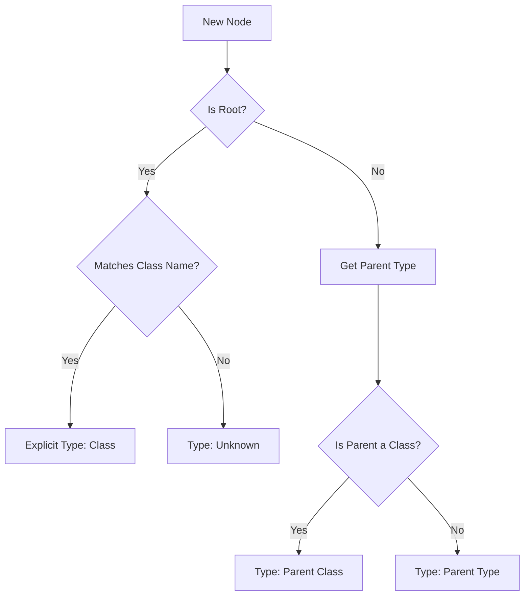

# Creating Models

Once you have defined your metamodel, the next step is to create the actual model instances. This guide covers how to build and structure your model in kNNowledge.

## The Model Structure

The model is defined in the `## Model` section of your `.nn.md` file. It uses a hierarchical outline format similar to Logseq or Roam Research.

### Basic Syntax

```markdown
## Model

- [[Class Name]]
    - [[Instance Name]]
        - [[Child Instance]]
```

**Key Rules:**
1. **Wikilinks**: All nodes must be wrapped in `[[double brackets]]`.
2. **Hierarchy**: Use indentation (tab or 4 spaces) to define parent-child relationships.
3. **Root Nodes**: The top-level nodes usually correspond to your Metamodel Classes.

## Step-by-Step Creation

### 1. Define Root Categories
Start by listing the classes from your metamodel as the root nodes. This helps organize your instances by type.

```markdown
- [[Task]]
- [[Person]]
- [[Resource]]
```

### 2. Add Instances
Add specific instances under their respective class roots.

```markdown
- [[Task]]
    - [[Design Database Schema]]
    - [[Setup CI/CD Pipeline]]
- [[Person]]
    - [[Alice]]
    - [[Bob]]
```

### 3. Create Hierarchies
You can nest instances to represent sub-items, breakdown structures, or grouping.

```markdown
- [[Task]]
    - [[Backend Development]]        <-- Parent Task
        - [[API Design]]            <-- Subtask
        - [[Database Implementation]] <-- Subtask
            - [[Tables]]            <-- Sub-subtask
            - [[Indexes]]
```

## Type Inference



kNNowledge automatically infers the **Type** (Class) of each node based on its position in the hierarchy.

1. **Explicit Type**: If a node is at the root level and matches a Metamodel Class name, its type is that Class.
2. **Inherited Type**: Child nodes inherit the type of their parent, *unless* the parent is a Class itself, in which case they take that Class type.

**Example:**
```markdown
- [[Task]]                  <-- Type: Task (Explicit)
    - [[Project A]]         <-- Type: Task (Inherited from parent 'Task')
        - [[Phase 1]]       <-- Type: Task (Inherited from parent 'Project A')
```

## Adding Documentation to Nodes
You can add detailed documentation to any node. This is stored in the `## Documentation` section but can be edited directly in the UI.

1. Click on a node in any view.
2. The **Item Detail Panel** opens on the right.
3. Switch to the **Documentation** tab.
4. Write your content in Markdown.

## Best Practices

### Naming Conventions
- **Unique Names**: Ensure every node has a unique name across the entire model. `[[Project A]]` under `[[Task]]` and `[[Project A]]` under `[[Archive]]` will be treated as the *same node* (cloned).
- **Descriptive**: Use clear, human-readable names.
- **Avoid Special Characters**: Stick to alphanumeric characters and spaces for best compatibility.

For more detailed guidance on semantic naming (PascalCase, camelCase, etc.), see the [Modeling Best Practices](modeling-best-practices.md#naming-conventions) guide.

### Organizing Large Models
- **Group by Context**: Use intermediate nodes to group related items.
    ```markdown
    - [[Task]]
        - [[Q1 Goals]]
            - [[Task 1]]
            - [[Task 2]]
    ```
- **Limit Depth**: While unlimited nesting is supported, 3-5 levels is usually optimal for readability.

## Editing in the UI vs. File

| Action       | UI (Navigator View)      | File (.nn.md)                  |
| ------------ | ------------------------ | ------------------------------ |
| **Add Node** | Right-click -> Add Child | Add new line with `- [[Name]]` |
| **Rename**   | Click name to edit       | Edit text inside `[[ ]]`       |
| **Move**     | Drag and drop (future)   | Cut and paste lines            |
| **Delete**   | Right-click -> Delete    | Remove line                    |

## Common Issues

**"My node shows up as 'Unknown Type' or gray icon"**
- Check if the root parent matches a Class name in your Metamodel exactly (case-sensitive).
- Ensure the Class is defined in the `## Metamodel` section.

**"I have duplicate nodes"**
- If you use the same name `[[Node A]]` in two places, kNNowledge treats them as the same entity appearing in multiple locations (transclusion). If this is not intended, give them unique names like `[[Node A (Context 1)]]`.
