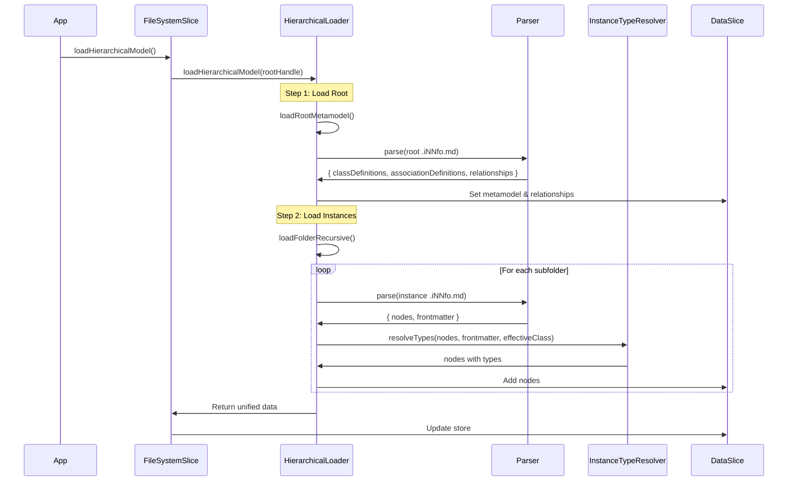

# Hierarchical Loader

The `HierarchicalLoader` service is responsible for recursively loading and merging `.iNNfo.md` files from a folder hierarchy into a unified model.

## Architecture: Centralized Metamodel

iNNfo uses a **centralized architecture** where:

- **Metamodel** is defined ONLY in the root `model/.iNNfo.md` file
- **Relationships** are stored ONLY in the root file (`graph_edges` section)
- **Instance files** contain only node metadata and content
- **No metamodel merging** - single source of truth at root

This is referred to as **Option A** in the codebase.

## File Structure

```text
model/
├── .iNNfo.md                    # ROOT: Metamodel + Relationships
├── Task/                        # Class folder
│   ├── Design-Homepage/         # Instance folder
│   │   ├── .iNNfo.md           # Instance metadata
│   │   ├── content.md          # Additional files (flat)
│   │   └── screenshot.png
│   └── Implement-Login/
│       └── .iNNfo.md
└── Person/
    ├── Alice/
    │   └── .iNNfo.md
    └── Bob/
        └── .iNNfo.md
```

## Loading Process

### 1. Load Root Metamodel

The loader starts by reading the root `.iNNfo.md` file:

```typescript
// STEP 1: Load root .iNNfo.md for metamodel and relationships
await this.loadRootMetamodel(rootHandle, unifiedData);
```

**What it loads:**

- Class definitions (`metamodel.classes`)
- Association definitions (`metamodel.relationships`)
- Centralized relationships (`graph_edges`)

**Validation:**

- Verifies `type: model_root` in frontmatter
- Logs warning if not found but continues

### 2. Recursive Instance Loading

After loading the metamodel, the loader recursively scans subfolders:

```typescript
// STEP 2: Recursively load instance nodes from folder hierarchy
await this.loadFolderRecursive(rootHandle, '', unifiedData, null);
```

**For each folder:**

1. **Check for `.iNNfo.md` file** using flexible naming:
   - `[slug].iNNfo.md` (e.g., `john-lennon.iNNfo.md`)
   - `.iNNfo.md` (flat naming)

2. **Determine archetype** from frontmatter `type`:
   - `class` or `class_index` → Class folder marker
   - `instance` → Instance node

3. **Resolve instance types** immediately after parsing:
   - Uses `InstanceTypeResolver` to ensure all nodes have a type
   - Prevents untyped nodes from entering the unified data

4. **Recursively process subfolders**

## Flexible File Naming

The loader supports two naming patterns:

### Pattern 1: Slug-based (Unique)

```text
model/Member/john-lennon/
└── john-lennon.iNNfo.md
```

### Pattern 2: Flat

```text
model/Member/john-lennon/
└── .iNNfo.md
```

The `findInfoFile` utility from `fileNamingUtils.ts` handles both patterns automatically.

## Type Resolution

**Critical Feature:** The loader ensures ALL nodes have a type before adding them to the unified data.

```typescript
// CRITICAL FIX: Resolve types IMMEDIATELY after parsing
InstanceTypeResolver.resolveTypes(data.nodes, data.frontmatter, effectiveClass);
```

**Type Resolution Strategy:**

1. **Explicit type** in node data → Use it
2. **Frontmatter class** → Use it
3. **Effective class** from folder context → Use it
4. **Fallback** → Mark as unclassified

**Debug Logging:**

```typescript
const stats = InstanceTypeResolver.getTypeStats(data.nodes);
logger.debug(`Loaded ${data.nodes.length} nodes:`, {
    typed: stats.typed,
    untyped: stats.untyped,
    types: Object.keys(stats.typeDistribution).join(', ')
});
```

## Class Folder Detection

The loader can detect class folders in two ways:

### Method 1: Explicit Frontmatter

```yaml
---
type: class
class: Member
---
```

### Method 2: Folder Name Derivation

If no explicit class is found, the loader derives it from the folder name:

```typescript
// Convert folder name to class name
// "Members" -> "MEMBER", "Albums" -> "ALBUM"
className = dirHandle.name.replace(/s$/, '').toUpperCase();
```

## Data Flow



## Error Handling

The loader is designed to be resilient:

```typescript
try {
    // Load operations
} catch (error) {
    logger.warn(`Error loading folder hierarchy at ${relativePath}:`, error);
}
```

**Error Scenarios:**

- **Missing root file** → Warning logged, empty metamodel
- **Invalid frontmatter** → Warning logged, continues
- **Parse errors** → Logged, folder skipped
- **Permission errors** → Logged, folder skipped

## Usage Example

```typescript
import { HierarchicalLoader } from '@/services/hierarchicalLoader';

// Load a model from a directory handle
const rootHandle = await window.showDirectoryPicker();
const unifiedData = await HierarchicalLoader.loadHierarchicalModel(rootHandle);

// unifiedData contains:
// - classDefinitions: ClassDefinition[]
// - associationDefinitions: AssociationDefinition[]
// - nodes: Node[]
// - relationships: Relationship[]
```

## Integration with Store

The `FileSystemSlice` uses the HierarchicalLoader:

```typescript
loadHierarchicalModel: async (dirHandle: FileSystemDirectoryHandle) => {
    const data = await HierarchicalLoader.loadHierarchicalModel(dirHandle);
    
    set((state) => {
        state.classDefinitions = data.classDefinitions;
        state.associationDefinitions = data.associationDefinitions;
        state.nodes = data.nodes;
        state.relationships = data.relationships;
    });
}
```

## Performance Considerations

**Optimization Strategies:**

1. **Async iteration** - Uses `for await` to avoid blocking
2. **Lazy loading** - Only loads files with `.iNNfo.md` marker
3. **Type resolution** - Happens once per file, not per node
4. **Logging** - Debug logs only, minimal overhead

**Scalability:**

- Tested with 100+ instances across 20+ classes
- Handles deep folder hierarchies (10+ levels)
- Memory efficient - processes one file at a time

## Migration from Legacy `.nn.md`

The HierarchicalLoader is designed for the new distributed architecture. For migrating from legacy `.nn.md` files:

1. Use the **Migration Wizard** AI skill
2. Or manually create the folder structure
3. The parser still supports `.nn.md` for backward compatibility

## Best Practices

1. **Always define metamodel in root** - Don't duplicate class definitions
2. **Use explicit enrollment** - Create `.iNNfo.md` only for folders you want in the model
3. **Keep attachments flat** - Store files in the same folder as `.iNNfo.md`
4. **Use meaningful folder names** - They may be used for class derivation
5. **Test type resolution** - Check logs to ensure all nodes are typed

## Troubleshooting

### Nodes Not Appearing

**Symptom:** Instances don't show up in the UI

**Causes:**

1. Missing `.iNNfo.md` file → Add it
2. Wrong `type` in frontmatter → Should be `instance`
3. Class not in metamodel → Add to root `.iNNfo.md`
4. Type resolution failed → Check logs

### Metamodel Not Loading

**Symptom:** Classes and relationships missing

**Causes:**

1. Root file not found → Ensure `model/.iNNfo.md` exists
2. Wrong `type` → Should be `model_root`
3. Invalid YAML → Check frontmatter syntax

### Performance Issues

**Symptom:** Slow loading with large models

**Solutions:**

1. Reduce debug logging in production
2. Use selective loading (load only needed classes)
3. Consider model splitting for very large projects (1000+ instances)

## Future Enhancements

Planned improvements:

- **Incremental loading** - Load only changed files
- **Caching** - Cache parsed results
- **Parallel loading** - Load multiple folders concurrently
- **Progress reporting** - Show loading progress to user
- **Validation** - Stricter validation of file structure

## Related Documentation

- [File Format](../02-user-guide/file-format.md) - `.iNNfo.md` specification
- [Architecture](./architecture.md) - Overall system design
- [Parser System](./parser.md) - How files are parsed
- [State Management](./state-management.md) - How data flows to the store
