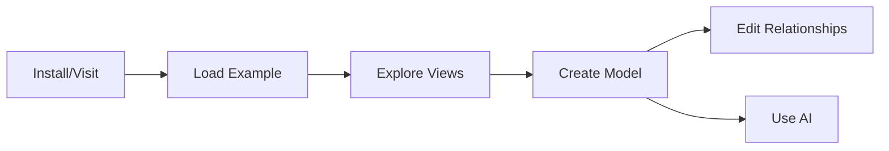
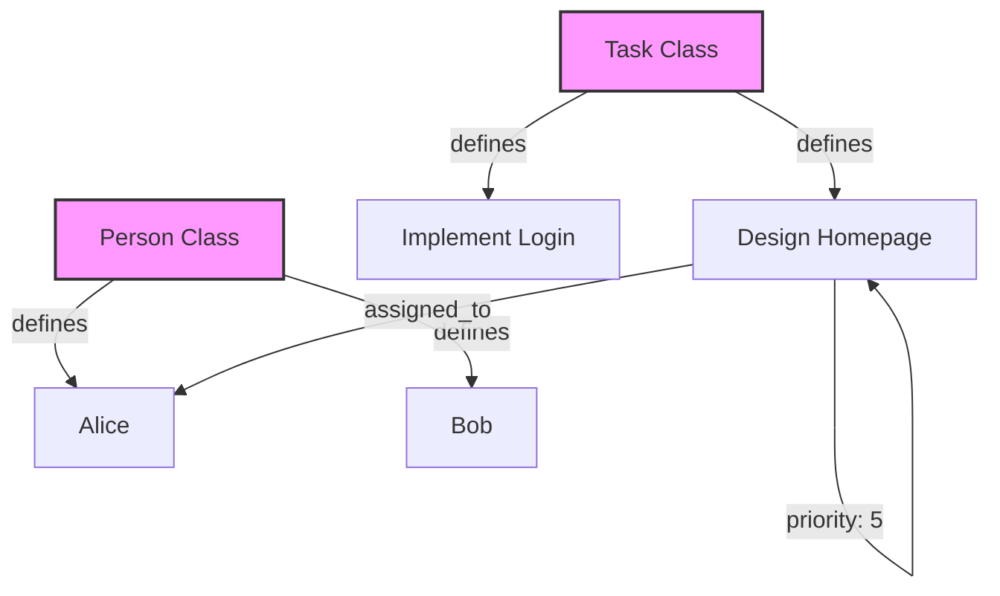

# Getting Started

This guide will help you create your first model in kNNowledge.

## Prerequisites

- Modern web browser (Chrome, Firefox, Edge, Safari)
- Text editor (optional, for editing `.nn.md` files externally)
- Google Gemini API key (optional, for AI features)

## Installation

### Option 1: Run Locally

```bash
# Clone the repository
git clone https://github.com/[your-org]/knnowledge.git
cd knnowledge/app

# Install dependencies
npm install

# Start development server
npm run dev
```

Open `http://localhost:5173` in your browser.



### Option 2: Use Deployed Version

Visit the deployed application at `[deployment URL]`.

## Your First Model

Let's create a simple task management model.

### Step 1: Understand the Interface

When you open kNNowledge, you'll see:

- **Top Navigation** - View switcher (Navigator, Matrices, Metamodel, History, Docs, Source Import, Skills)
- **Main Area** - Current view content
- **Detail Panel** - Integrated viewer/editor for entity properties and documentation
- **Top Bar Controls** - Folder selector, model switcher, and save/refresh buttons
- **AI/Skills Panel** - Access to specialized AI assistants and tools

### Step 2: Load an Example

You can start quickly from the Welcome Screen:

1. Click **"Load Getting Started Guide"** at the bottom of the screen.
2. Or click **"Load Full Test Model"** to see a comprehensive example.

Alternatively, to load other examples:
1. Click **File Actions** (folder icon, bottom left)
2. Select one of the example files:
   - `example-email-response.nn.md` - Simple workflow
   - `example-organization.nn.md` - Organization structure
3. Click **Load**

The model will load and display in the Navigator view.


### Step 3: Explore Views

Click through the views to understand different perspectives:

**Metamodel View** - See the class structure defined in your YAML configuration.

**Navigator View** - See the hierarchical model instances

**Matrix View** - Manage relationships between instances

### Step 4: Create Your Own Model

Create a new file `my-tasks.nn.md`:

```markdown
---
metamodel:
  classes:
    Task:
      lucideIcon: CheckSquare
      color: blue
    Person:
      lucideIcon: User
      color: green
  relationships:
    - from: Task
      to: Person
      label: assigned_to
      widget: set
      config:
        options: [Alice, Bob, Charlie]
    - from: Task
      to: Task
      label: priority
      widget: scale
      config:
        min: 1
        max: 5
graph_edges:
  - from: Design Homepage
    to: Alice
    label: assigned_to
  - from: Design Homepage
    to: Design Homepage
    label: priority
    value: 5
---



# Task Management Model

## Model

- [[Task]]
    - [[Design Homepage]]
    - [[Implement Login]]
    - [[Write Tests]]
- [[Person]]
    - [[Alice]]
    - [[Bob]]
    - [[Charlie]]
```

### Step 5: Load Your Model

1. Save the file as `my-tasks.nn.md`
2. In kNNowledge, click **File Actions** → **Load**
3. Select your file

### Step 6: Edit Relationships

1. Switch to **Matrix View**
2. Select "Task → Person (assigned_to)" from the dropdown
3. Click cells to assign tasks to people
4. Try different widgets by creating new relationship types

### Step 7: Use AI Assistant (Optional)

1. Click **AI** button (bottom right)
2. Enter your Gemini API key
3. Try prompts like:
   - "Add a new task called 'Deploy to Production'"
   - "Add documentation to the Design Homepage task explaining the requirements"
   - "Create a relationship showing task dependencies"

## Understanding the File Format

The `.nn.md` file has three main sections:

### 1. Frontmatter (Required)
Defines metamodel classes, relationship definitions, and global instance relationships using YAML.

### 2. Model (Required)
Lists instances using Logseq-style outline with `[[wikilinks]]`.

### 3. Documentation (Optional)
Provides detailed Markdown documentation for specific nodes.

See [File Format](../02-user-guide/file-format.md) for complete specification.

## Common Workflows

### Adding a New Instance

**Via Navigator View:**
1. Right-click parent node → Add Child
2. Enter name in `[[brackets]]`

**Via AI:**
1. Open AI assistant
2. Say: "Add a new Task called 'Fix Bug #123'"

### Defining Relationships

**Via Matrix View:**
1. Select relationship type from dropdown
2. Click cells to set values
3. Values auto-save

**Via File Edit:**
1. Edit the Relationships section
2. Reload file

### Documenting Nodes

1. Click a node to open detail panel
2. Switch to "Documentation" tab
3. Write Markdown content
4. Save

## Tips

- **Use Wikilinks** - Always wrap node names in `[[double brackets]]`
- **Consistent Naming** - Keep node names unique and descriptive
- **Start Simple** - Begin with a small metamodel, expand later
- **Leverage AI** - Let AI generate boilerplate, refine manually
- **Version Control** - Commit `.nn.md` files to Git for history

## Troubleshooting

**Model won't load:**
- Check YAML syntax in frontmatter
- Ensure all `[[wikilinks]]` are properly closed
- Verify class names match YAML definitions

**Widgets not working:**
- Confirm widget type is spelled correctly in frontmatter
- Check config indentation (YAML is sensitive to spaces)
- Ensure relationship label exists in metamodel

**AI not responding:**
- Verify API key is correct
- Check browser console for errors
- Ensure internet connection

## Next Steps

- [Metamodel Definition](../02-user-guide/metamodel-definition.md) - Learn advanced metamodel features
- [Views Guide](../02-user-guide/views-guide.md) - Master all views
- [Widgets Overview](../04-widgets/widgets-overview.md) - Explore widget types
