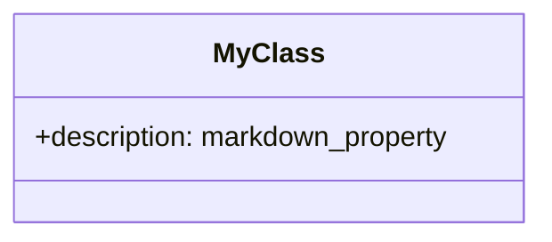
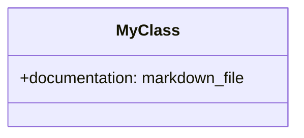

# Markdown Widgets

Markdown widgets allow you to store and edit formatted text using Markdown syntax. There are two variants depending on where the data is stored.

## 1. Markdown Property (`markdown_property`)

Stores the formatted content **inline** within the node's property data.

### Purpose
Best for short to medium-length content that you want to keep directly inside the knowledge model file (`.nn.md`).

### Metamodel Syntax


### Configuration
Currently supports standard `TextConfig` options:
- `placeholder`: Hint text shown when empty.

## 2. Markdown File (`markdown_file`)

Stores a reference to an **external .md file** in the node's folder.

### Purpose
Best for long-form content, extensive documentation, or articles. This keeps the main `.nn.md` file clean and allows for easier versioning of individual documents.

### Metamodel Syntax


### UI Behavior
- **Preview**: Displays a file icon 📄 followed by a snippet of the content.
- **Editing**: Opens a full-screen Markdown editor with live preview.
- **Auto-save**: For `markdown_file`, the system automatically manages the creation and naming of the external `.md` files.

## AI Assistant Usage

When interacting with the AI assistant, you should provide the markdown content as a string.

**Example Proposal:**
```json
{
  "action": "node.set.property",
  "parameters": {
    "target": "Project Alpha",
    "key": "content",
    "value": "# Progress Report\n\n- Task 1: Done\n- Task 2: Pending"
  }
}
```

If the property `content` is of type `markdown_file`, the AI's string value will be saved to `Project Alpha/content.md`.

## Use Cases
- **`markdown_property`**: Tooltips, short summaries, formatted metadata.
- **`markdown_file`**: Full articles, research papers, design specifications, user manuals.
