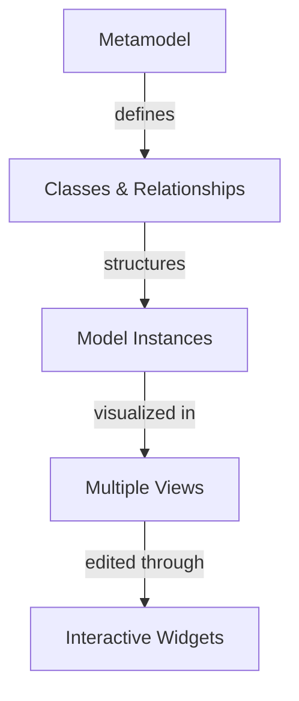

# Overview

**kNNowledge** is a visual modeling tool for creating and managing hierarchical models with metamodel-driven relationships. It enables users to define domain-specific modeling languages through metamodels and build structured models using a simple, human-readable file format.

## What is kNNowledge?

kNNowledge combines three powerful concepts:

1. **Metamodel-Driven Design** - Define your own modeling language with classes, relationships, and interaction widgets
2. **Hierarchical Modeling** - Build nested structures using familiar outline notation
3. **Visual Relationship Management** - Manage complex relationships through interactive matrices

## Core Concept

## The `.nn.md` File Format

Models are stored in a single Markdown file (`.nn.md`) containing:

- **Metamodel** - Class definitions and relationship rules (Mermaid classDiagram)
- **Model** - Hierarchical instances (Logseq-style outline)
- **Relationships** - Connections between instances (Mermaid graph)
- **Documentation** - Optional detailed descriptions for nodes

## Key Benefits

- **Single File** - Everything in one portable, version-controllable file
- **Human-Readable** - Plain Markdown with Mermaid diagrams
- **Flexible** - Define any domain model (workflows, organizations, systems, etc.)
- **Visual** - Multiple views for different perspectives
- **AI-Powered** - Built-in AI assistant for model generation

## Use Cases

- **Workflow Modeling** - Define processes with tasks, roles, and artifacts
- **Organization Charts** - Model teams, roles, and responsibilities
- **System Architecture** - Document components and dependencies
- **Requirements Management** - Track features, stakeholders, and priorities
- **Knowledge Graphs** - Build interconnected concept networks

## Who is it For?

- **Business Analysts** - Model processes and requirements
- **System Architects** - Document system structures
- **Project Managers** - Plan workflows and dependencies
- **Developers** - Design and document software architecture
- **Knowledge Workers** - Organize complex information

## Next Steps

- [Key Features](./key-features.md) - Explore what kNNowledge can do
- [Getting Started](./getting-started.md) - Create your first model
- [File Format](../02-user-guide/file-format.md) - Deep dive into `.nn.md` syntax

## Coming from Notion?

If you are a regular Notion user, you might find kNNowledge familiar yet different. Check out our [Comparison with Notion](./comparativa-notion.md) to understand the key differences in philosophy and terminology.

