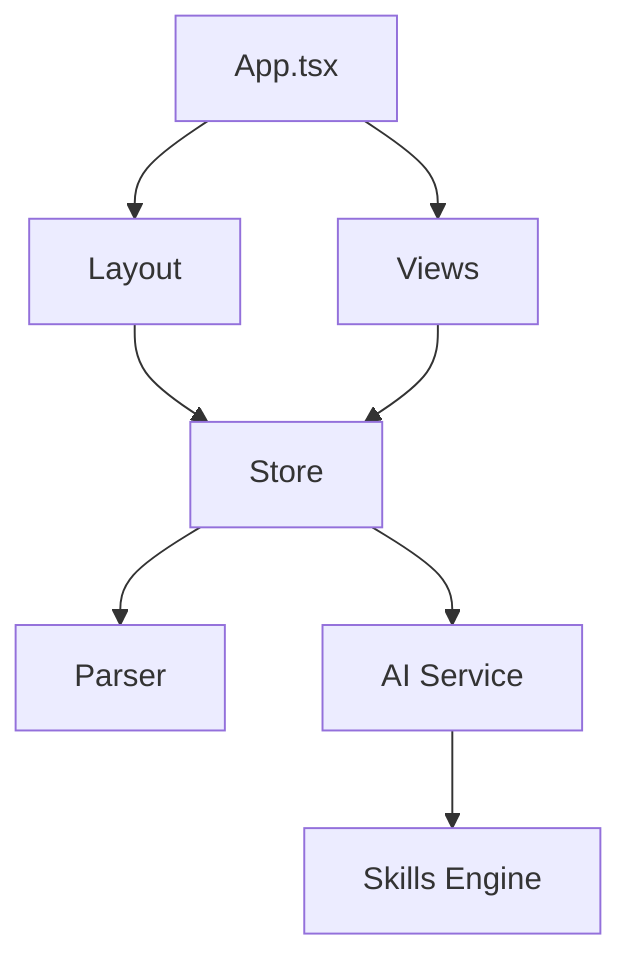

# Project Structure

Overview of the kNNowledge codebase organization.

## Directory Tree

```
knnowledge/
├── app/                          # Main application
│   ├── public/                   # Static assets
│   │   ├── docs/                 # Documentation (served via DocumentationView)
│   │   ├── logo.png              # Application logo
│   │   └── vite.svg              # Vite icon
│   ├── src/                      # Source code
│   │   ├── components/           # React components
│   │   │   ├── common/           # Shared components (Layout, FileActions)
│   │   │   ├── editors/          # Complex entity editors
│   │   │   ├── views/            # Main application views
│   │   │   ├── widgets/          # Interactive relationship widgets
│   │   │   ├── panels/           # Slide-out panels (AIChat, ActionPlan)
│   │   │   └── ui/               # Base UI primitives (shadcn/ui)
│   │   ├── store/                # Zustand state management
│   │   │   ├── slices/           # Modular state slices
│   │   │   └── index.ts          # Store initialization and merging
│   │   ├── utils/                # Pure utility functions
│   │   ├── lib/                  # Service integrations and core parsers
│   │   │   ├── ai/               # AI service and skills logic
│   │   │   └── parser.ts         # .nn.md file parser
│   │   ├── hooks/                # Custom React hooks
│   │   ├── types/                # Global TypeScript definitions
│   │   ├── App.tsx               # Main app component and routing
│   │   ├── main.tsx              # Application entry point
│   │   └── index.css             # Global styles and tailwind
│   ├── package.json              # Dependencies and scripts
│   └── vite.config.ts            # Vite configuration
├── models/                       # Sample .nn.md models
└── README.md                     # Project overview
```

## Core Directories

### `/app/src/components/`

React components organized by functional area.

#### `/common/`
Foundational UI elements and application shell components.

| File                     | Purpose                                           |
| ------------------------ | ------------------------------------------------- |
| `Layout.tsx`             | Main shell with top navigation and view switching |
| `FileControlButtons.tsx` | Folder loading and model management controls      |
| `MermaidRenderer.tsx`    | High-performance Mermaid diagram rendering        |
| `EmptyModelState.tsx`    | Landing state when no model is active             |

#### `/views/`
Top-level page components for each application mode.

| File                    | Purpose                                      |
| ----------------------- | -------------------------------------------- |
| `HomeView.tsx`          | Dashboard landing page with model statistics |
| `NavigatorView.tsx`     | Graph-aware hierarchical explorer            |
| `MatrixView.tsx`        | Relationship management grid                 |
| `MetamodelView.tsx`     | Class diagram and rules definition           |
| `SourceImportView.tsx`  | Document ingestion and AI extraction         |
| `SkillsDashboard.tsx`   | AI skill management and configuration        |
| `HistoryView.tsx`       | Model change history and audit log           |
| `DebugView.tsx`         | Developer debugging and inspection tools     |
| `DocumentationView.tsx` | Documentation reader interface               |

### `/app/src/store/`

Centralized state management using Zustand and Immer.

| Directory/File | Purpose                                         |
| -------------- | ----------------------------------------------- |
| `slices/`      | Modular slices (Data, UI, FileSystem, AI, etc.) |
| `index.ts`     | Combined store hook and initialization logic    |
| `types.ts`     | State-specific TypeScript interfaces            |

### `/app/src/lib/`

Heavy-lifting logic and external integrations.

| File         | Purpose                                      |
| ------------ | -------------------------------------------- |
| `parser.ts`  | Bidirectional parser for the `.nn.md` format |
| `ai.ts`      | Google Gemini API integration                |
| `ai/skills/` | Skill loading and execution engine           |

## Configuration Files

### `package.json`
- Dependencies and dev dependencies
- npm scripts (`dev`, `build`, `lint`, `preview`)
- Project metadata

### `tsconfig.json`
- TypeScript compiler options
- Includes `tsconfig.app.json` and `tsconfig.node.json`

### `vite.config.ts`
- Vite build configuration
- React plugin setup
- Base path for deployment

### `tailwind.config.js`
- Tailwind CSS configuration
- Custom theme extensions
- Plugin configurations

### `eslint.config.js`
- ESLint rules
- TypeScript ESLint integration
- React-specific linting

### `postcss.config.js`
- PostCSS plugins
- Tailwind CSS processing

## Key Files

### Entry Points

| File           | Purpose                                  |
| -------------- | ---------------------------------------- |
| `index.html`   | HTML template, app title, root div       |
| `src/main.tsx` | React app initialization, renders `App`  |
| `src/App.tsx`  | Main app component, view routing, layout |

### Styling

| File            | Purpose                            |
| --------------- | ---------------------------------- |
| `src/index.css` | Global styles, Tailwind directives |
| `src/App.css`   | App-specific styles                |

## Data Flow


1. **Load:** FileSystem → Parser → DataSlice → Views
2. **Edit:** Interaction → DataSlice → Views
3. **Save:** DataSlice → Parser → FileSystem

## Module Dependencies



## Build Output

### Development (`npm run dev`)
- Served from memory
- Source maps enabled
- Hot Module Replacement (HMR)

### Production (`npm run build`)
```
dist/
├── assets/
│   ├── index-[hash].js      # Bundled JavaScript
│   ├── index-[hash].css     # Bundled CSS
│   └── [asset]-[hash].[ext] # Hashed assets
├── index.html               # Entry HTML
└── [public files]           # Copied from public/
```

## Code Organization Principles

### 1. Separation of Concerns
- **Components:** UI only
- **Store:** State management
- **Parser:** File I/O
- **Types:** Data structures

### 2. Single Responsibility
Each file has one clear purpose.

### 3. Reusability
Common components (`ItemBadge`, `MatrixCell`) used across views.

### 4. Type Safety
All data structures defined in `types.ts`, used throughout.

### 5. Modularity
Features can be added/removed independently (e.g., new widgets).

## Naming Conventions

### Files
- **Components:** PascalCase (e.g., `ItemBadge.tsx`)
- **Utilities:** camelCase (e.g., `parser.ts`)
- **Types:** camelCase (e.g., `types.ts`)
- **Styles:** kebab-case or camelCase (e.g., `App.css`)

### Components
- **Functional components:** PascalCase
- **Hooks:** `use` prefix (e.g., `useStore`)
- **Props interfaces:** `[ComponentName]Props`

### Variables
- **camelCase:** Most variables
- **UPPER_SNAKE_CASE:** Constants
- **PascalCase:** Types, interfaces, classes

## Import Patterns

### Alias Imports
Uses `@/` for `src/` to avoid fragile relative paths:

```typescript
import { useStore } from '@/store';
import { parser } from '@/lib/parser';
```

### Barrel Exports
Not used. Import directly from files.

## Testing Structure (Future)

```
app/
├── src/
│   └── __tests__/
│       ├── components/
│       ├── core/
│       └── lib/
```

## Documentation Updates

Update this document when:
- New top-level directories are added to `src/`
- Major component categories are reorganized
- The state management pattern changes
