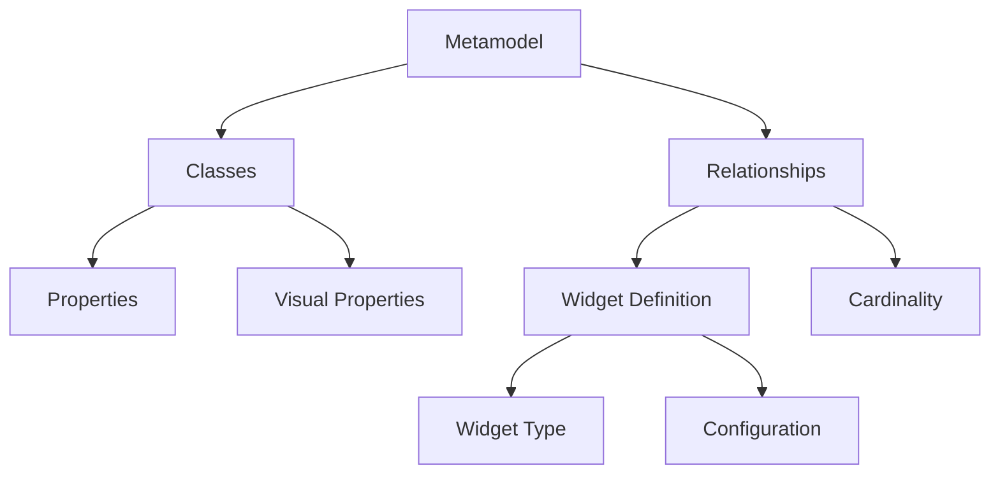
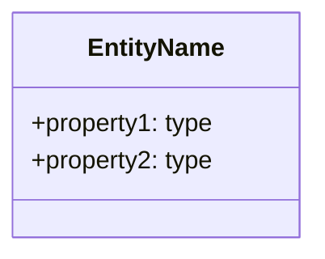
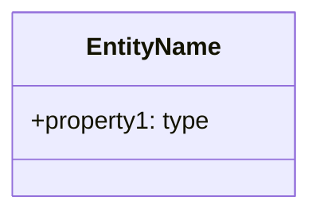
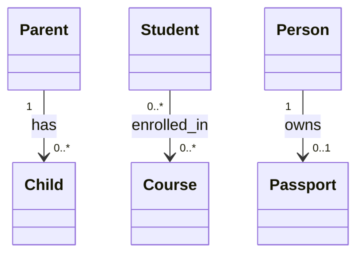

# Metamodel for AI

**Purpose:** Guide AI assistants in understanding and generating metamodel structures for kNNowledge.

## Metamodel Fundamentals

A metamodel defines:
1. **Classes** - Types of entities in your domain
2. **Relationships** - How entities connect
3. **Widgets** - How users interact with relationships
4. **Visual Properties** - Icons and colors for UI

## Metamodel Structure



## Class Definition Pattern

### Basic Class



### Class with Visual Properties



**Icon Selection Guidelines:**
- **Lucide Icons:** Professional, consistent (use for production)
- **Emojis:** Quick, expressive (use for prototyping)
- Choose icons that clearly represent the entity

**Color Guidelines:**
- Use semantic colors (e.g., `blue` for processes, `green` for success states)
- Maintain consistency across related classes
- Limit to 3-4 colors per metamodel for clarity

## Relationship Definition Pattern

### Anatomy of a Relationship

```
SourceClass "cardinality" --> "cardinality" TargetClass : label {widget:type, config:{...}}
```

**Components:**

1. **SourceClass** - Where the relationship originates
2. **TargetClass** - Where the relationship points
3. **Cardinality** - Multiplicity (optional, for documentation)
4. **Label** - Unique identifier for this relationship
5. **Widget** - Interaction mechanism
6. **Config** - Widget-specific settings

### Choosing the Right Widget

| Use Case            | Widget    | Example                     |
| ------------------- | --------- | --------------------------- |
| Yes/No decision     | `binary`  | Is this critical?           |
| Rating or score     | `scale`   | Impact score 1-10           |
| Fixed options       | `set`     | Priority: High/Medium/Low   |
| Status progression  | `cycle`   | Status: Todo → Doing → Done |
| Quantity or amount  | `number`  | Budget, percentage, count   |
| Free-form notes     | `text`    | Comments, descriptions      |
| Diagram connections | `mermaid` | Flowchart relationships     |

### Cardinality Patterns



## Common Metamodel Patterns

### 1. Workflow Pattern

```mermaid
classDiagram
    class Work
    class Object
    class Role
    class Tool
    
    Work --> Work : next {widget:cycle, config:{values:[Sequential, Parallel, Conditional]}}
    Work --> Object : input {widget:text}
    Work --> Object : output {widget:text}
    Work --> Role : executor {widget:set, config:{options:[Developer, Manager, Designer]}}
    Work --> Tool : uses {widget:binary}
```

**Use for:** Process modeling, workflows, procedures

### 2. Organization Pattern

```mermaid
classDiagram
    class Department
    class Person
    class Role
    
    Department --> Department : reports_to {widget:binary}
    Department --> Person : member {widget:set, config:{options:[Full-time, Part-time, Contractor]}}
    Person --> Role : has_role {widget:set, config:{options:[Manager, Developer, Designer]}}
```

**Use for:** Org charts, team structures, hierarchies

### 3. Requirements Pattern

```mermaid
classDiagram
    class Feature
    class Stakeholder
    class Component
    
    Feature --> Feature : depends_on {widget:binary}
    Feature --> Stakeholder : priority {widget:scale, config:{min:1, max:5}}
    Feature --> Component : implements_in {widget:set, config:{options:[Frontend, Backend, Database]}}
    Feature --> Feature : status {widget:cycle, config:{values:[Backlog, In Progress, Done]}}
```

**Use for:** Requirements management, feature tracking

### 4. Knowledge Graph Pattern

```mermaid
classDiagram
    class Concept
    
    Concept --> Concept : related_to {widget:set, config:{options:[is-a, part-of, uses, depends-on]}}
    Concept --> Concept : strength {widget:scale, config:{min:1, max:10}}
```

**Use for:** Knowledge bases, concept maps, ontologies

### 5. System Architecture Pattern

```mermaid
classDiagram
    class Component
    class Interface
    class DataStore
    
    Component --> Component : depends_on {widget:binary}
    Component --> Interface : exposes {widget:text}
    Component --> DataStore : reads_from {widget:binary}
    Component --> DataStore : writes_to {widget:binary}
```

**Use for:** Architecture diagrams, system design

## Metamodel Design Principles

### 1. Keep It Simple
- Start with 2-4 classes
- Add complexity only when needed
- Avoid over-engineering

### 2. Use Clear Names
- **Classes:** Nouns (Work, Person, Component)
- **Relationships:** Verbs or verb phrases (assigned_to, depends_on, has)
- **Properties:** Descriptive (name, description, status)

### 3. Choose Appropriate Widgets
- **Binary:** For simple yes/no
- **Scale:** For subjective ratings
- **Set:** For predefined, stable options
- **Cycle:** For status that changes frequently
- **Number:** For quantitative data
- **Text:** For qualitative data

### 4. Consistent Cardinality
- Use cardinality to document intent
- `"1"` - exactly one
- `"0..1"` - optional, at most one
- `"0..*"` - optional, many
- `"1..*"` - required, at least one

### 5. Semantic Colors
- Blue: Processes, actions
- Green: Success, completion, resources
- Red: Errors, critical items
- Yellow: Warnings, pending items
- Purple: Data, information
- Gray: Infrastructure, system

## AI Generation Guidelines

When generating a metamodel:

### Step 1: Identify Domain
Understand the user's domain (workflow, organization, system, etc.)

### Step 2: Extract Entities
Identify 2-5 core entity types (classes)

### Step 3: Define Relationships
For each pair of classes, ask:
- How do they relate?
- What information describes the relationship?
- How should users interact with it?

### Step 4: Select Widgets
Choose widgets based on:
- Data type (boolean, number, text, enum)
- User interaction pattern (click, select, input)
- Frequency of change

### Step 5: Add Visual Properties
- Assign icons that represent each class
- Use colors to group related classes
- Ensure visual consistency

## Example: AI-Generated Metamodel

**User Request:** "Create a metamodel for tracking software bugs"

**AI Response:**

```mermaid
classDiagram
    %% @lucideIcon Bug
    %% @color red
    class Bug {
        +title: string
        +description: string
    }
    
    %% @lucideIcon User
    %% @color blue
    class Developer {
        +name: string
    }
    
    %% @lucideIcon Package
    %% @color purple
    class Component {
        +name: string
    }
    
    Bug "1" --> "0..1" Developer : assigned_to {widget:set, config:{options:[Alice, Bob, Charlie], allowEmpty:true}}
    Bug "1" --> "1" Bug : severity {widget:scale, config:{min:1, max:5, startColor:yellow-400, endColor:red-600}}
    Bug "1" --> "1" Bug : status {widget:cycle, config:{values:[New, In Progress, Testing, Closed], allowNull:false}}
    Bug "1" --> "1..*" Component : affects {widget:binary}
    Bug "0..*" --> "0..*" Bug : related_to {widget:text, config:{placeholder:Describe relationship}}
```

**Explanation:**
- **Bug:** Core entity with severity and status
- **Developer:** Person who fixes bugs
- **Component:** System parts affected
- **Relationships:** Assignment, severity rating, status tracking, component impact

## Validation Checklist

Before finalizing a metamodel:

- [ ] All classes have meaningful names
- [ ] Icons and colors are assigned
- [ ] Relationships have clear labels
- [ ] Widget types match data types
- [ ] Configs are complete and valid
- [ ] Cardinality reflects business rules
- [ ] No duplicate relationship labels for same source-target pair

## Common Mistakes to Avoid

1. **Too many classes** - Start small, expand later
2. **Ambiguous labels** - Use clear, specific names
3. **Wrong widget** - Match widget to data type
4. **Missing config** - Always provide required config
5. **Inconsistent naming** - Use consistent case and style
6. **No visual properties** - Always add icons/colors for UX

## Updates

Update this document when:
- New widget types are added
- New metamodel patterns emerge
- Best practices evolve
