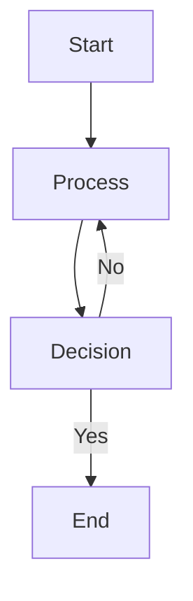
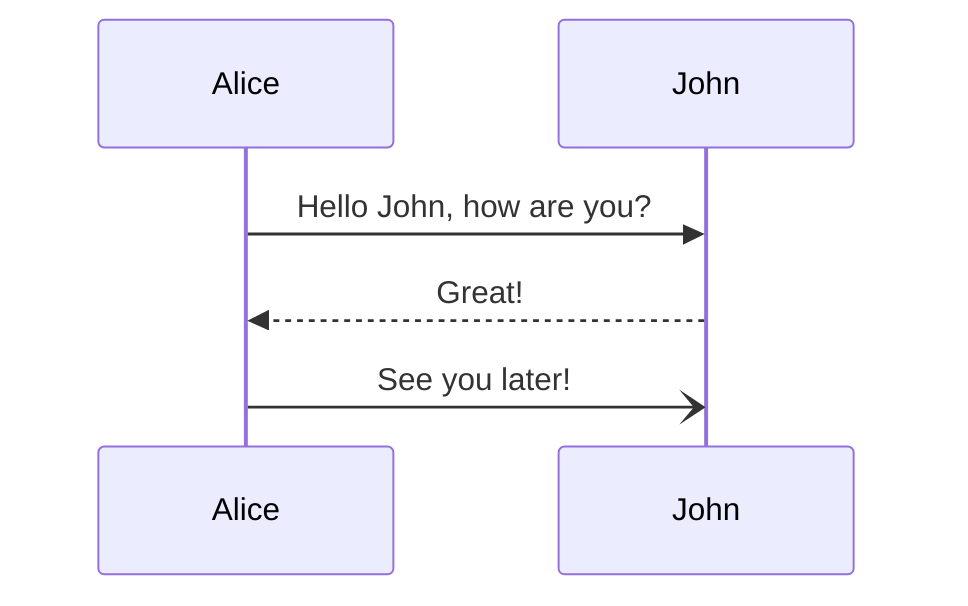
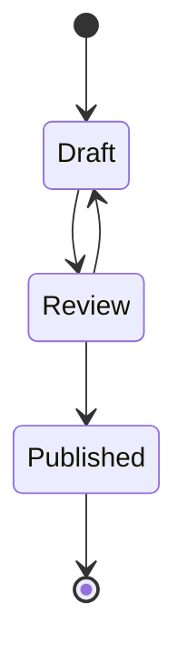
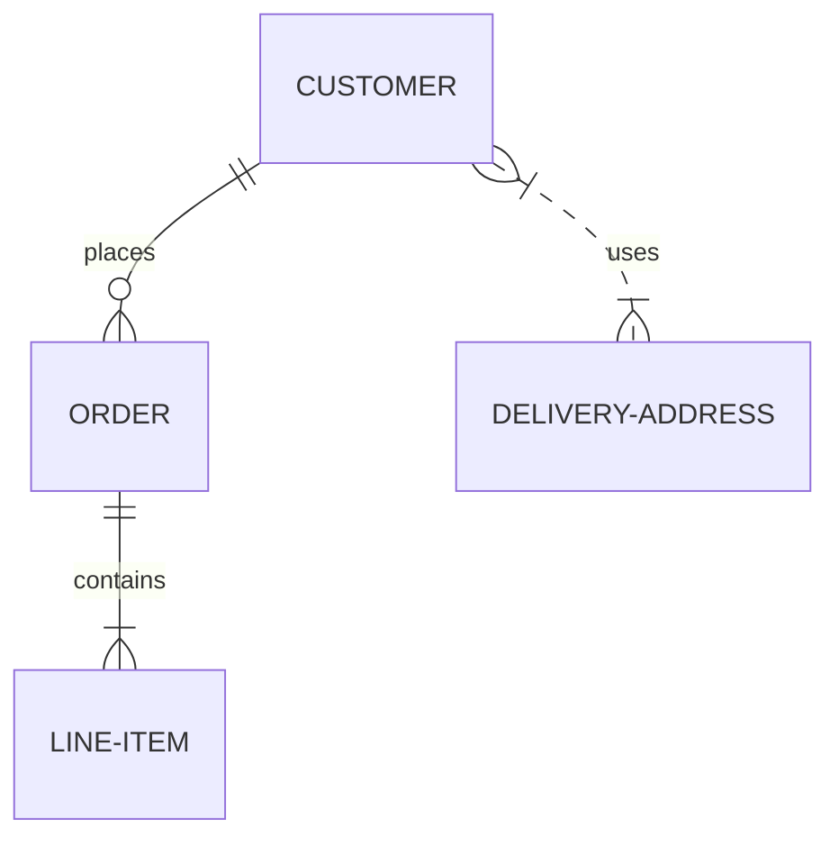
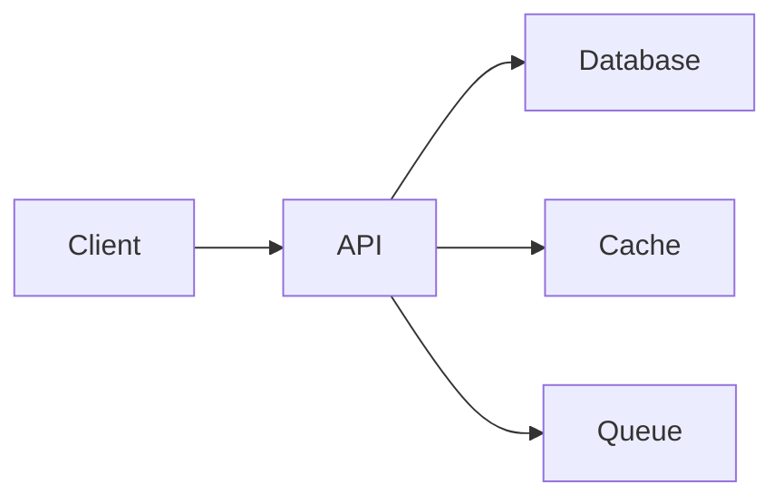
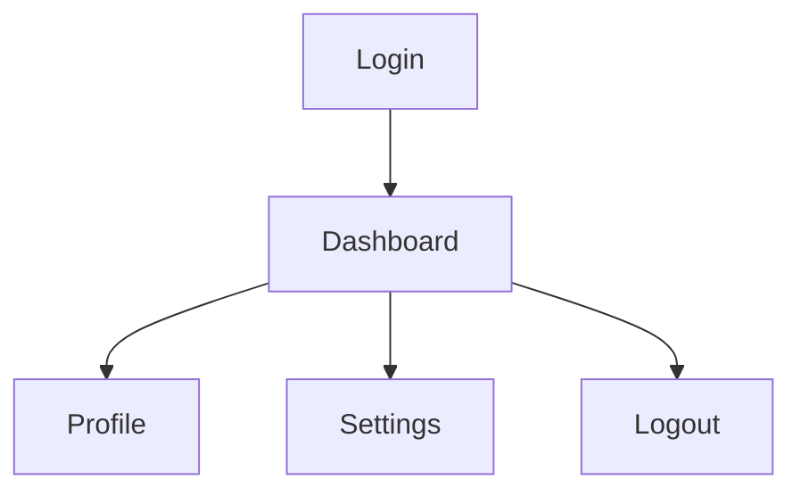
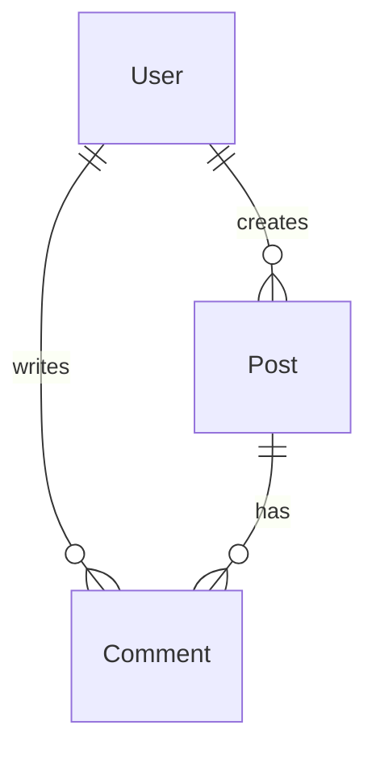
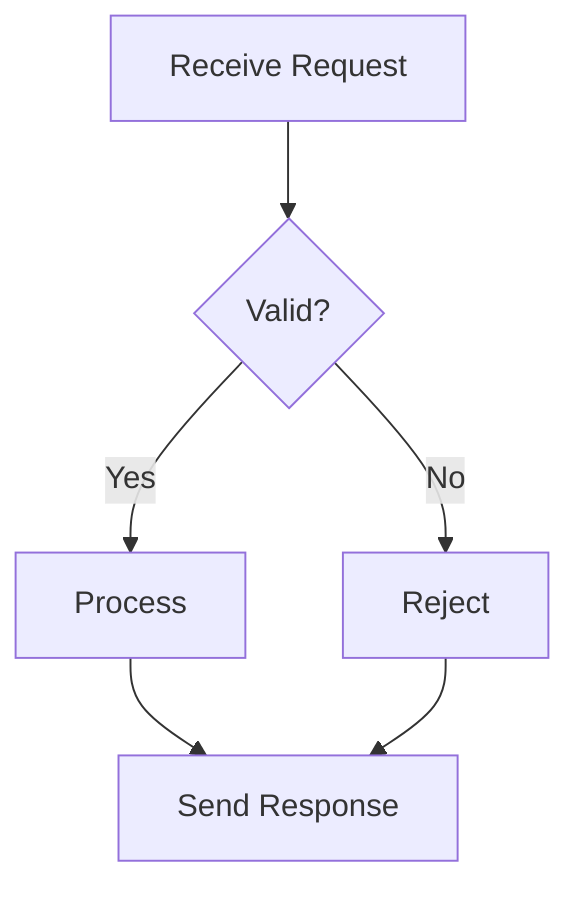

# Diagram Widget

## Overview

The **Diagram** widget is a powerful attribute type that allows you to store and visualize complete Mermaid diagram code. Unlike the `mermaid` widget which provides predefined relationship types, the `diagram` widget gives you full control to create any type of Mermaid diagram.

## Features

- **Full Mermaid Support**: Store complete Mermaid diagram code
- **Live Preview**: See your diagram rendered in real-time
- **Compact Display**: Shows a badge with diagram type in matrices and cards
- **Expandable Preview**: Click to see full diagram preview
- **Code Editor**: Edit diagram code with syntax highlighting
- **Configurable**: Set default templates and preview height

## Supported Diagram Types

The diagram widget supports all Mermaid diagram types:

- **Flowcharts** - Process flows and decision trees
- **Sequence Diagrams** - Interaction timelines
- **State Diagrams** - State machines and lifecycles
- **ER Diagrams** - Entity relationships
- **Gantt Charts** - Project timelines
- **Class Diagrams** - Object-oriented structures
- **Git Graphs** - Version control flows
- **Pie Charts** - Data visualization
- **And more** - Any valid Mermaid syntax

## Configuration

### DiagramConfig

```typescript
interface DiagramConfig {
    defaultTemplate?: string;  // Default Mermaid code template
    height?: number;           // Preview height in pixels (100-800)
}
```

### Example Configuration

```json
{
    "type": "diagram",
    "config": {
        "defaultTemplate": "graph TD;\n    A-->B;\n    B-->C;\n    C-->D;",
        "height": 300
    },
    "label": "Architecture Diagram",
    "description": "System architecture visualization"
}
```

## Usage Examples

### Basic Flowchart



### Sequence Diagram



### State Diagram



### ER Diagram



## Visual Representation

### In Matrices

The diagram widget displays as a compact purple badge showing the diagram type:

```
┌─────────────────┐
│ 📊 Flowchart   │
└─────────────────┘
```

### In Property Editor

The property editor shows:
- Code editor with syntax highlighting
- Live preview panel
- Toggle to show/hide preview
- Save and clear buttons

### In Cards

Displays with:
- Purple color scheme
- Code2 icon
- Diagram type label
- Expandable preview on hover

## Best Practices

1. **Keep It Simple**: Start with simple diagrams and add complexity gradually
2. **Use Comments**: Add comments in your Mermaid code for clarity
3. **Test Syntax**: Use the live preview to verify your diagram renders correctly
4. **Default Templates**: Set useful default templates for common diagram types
5. **Consistent Style**: Use consistent naming and styling across diagrams

## Common Use Cases

### System Architecture



### User Flow



### Data Model



### Process Flow



## Troubleshooting

### Diagram Not Rendering

- Check Mermaid syntax is valid
- Ensure diagram type is specified (e.g., `graph TD`, `sequenceDiagram`)
- Verify no special characters are breaking the syntax

### Preview Not Showing

- Click the eye icon to toggle preview
- Check if preview height is set appropriately
- Ensure the diagram code is not empty

### Performance Issues

- Keep diagrams reasonably sized
- Avoid extremely complex diagrams with hundreds of nodes
- Use subgraphs to organize large diagrams

## Related Widgets

- **mermaid** - Predefined relationship types for workflows
- **text** - Simple text storage
- **json** - Structured data storage

## Resources

- [Mermaid Documentation](https://mermaid.js.org/)
- [Mermaid Live Editor](https://mermaid.live/)
- [Mermaid Syntax Reference](https://mermaid.js.org/intro/syntax-reference.html)
