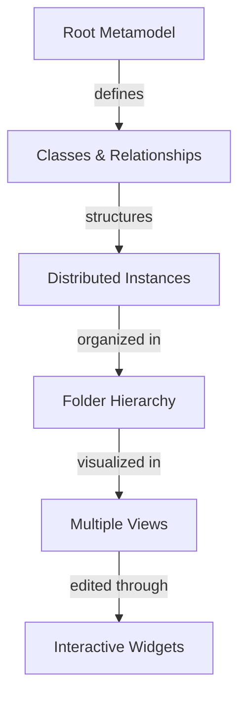

# Overview

**iNNfo** is a visual modeling tool for creating and managing hierarchical models with metamodel-driven relationships. It enables users to define domain-specific modeling languages through metamodels and build structured models using a distributed, hierarchical file format.

## What is iNNfo?

iNNfo combines three powerful concepts:

1. **Metamodel-Driven Design** - Define your own modeling language with classes, relationships, and interaction widgets
2. **Distributed Hierarchical Modeling** - Build nested structures across a folder hierarchy with `.iNNfo.md` files
3. **Visual Relationship Management** - Manage complex relationships through interactive matrices

## Core Concept

## The `.iNNfo.md` File Format

Models are stored in a **distributed folder hierarchy** with `.iNNfo.md` files:

- **Root File** (`.iNNfo.md`) - Metamodel and all relationships (centralized)
- **Instance Files** (`{Class}/{Instance}/.iNNfo.md`) - Individual node metadata and content
- **Attachments** - Additional files stored flat alongside `.iNNfo.md` files

### Key Benefits

- **Distributed Structure** - Organize large models across folders
- **Explicit Enrollment** - Only folders with `.iNNfo.md` are part of the model
- **Version Control Friendly** - Git-friendly folder structure
- **Human-Readable** - Plain Markdown with YAML frontmatter
- **Flexible** - Define any domain model (workflows, organizations, systems, etc.)
- **Visual** - Multiple views for different perspectives
- **AI-Powered** - Built-in AI assistant for model generation
- **Local-First** - Direct file system access, no server required

## Use Cases

- **Workflow Modeling** - Define processes with tasks, roles, and artifacts
- **Organization Charts** - Model teams, roles, and responsibilities
- **System Architecture** - Document components and dependencies
- **Requirements Management** - Track features, stakeholders, and priorities
- **Knowledge Graphs** - Build interconnected concept networks

## Who is it For?

- **Business Analysts** - Model processes and requirements
- **System Architects** - Document system structures
- **Project Managers** - Plan workflows and dependencies
- **Developers** - Design and document software architecture
- **Knowledge Workers** - Organize complex information

## Next Steps

- [Key Features](./key-features.md) - Explore what iNNfo can do
- [Getting Started](./getting-started.md) - Create your first model
- [File Format](../02-user-guide/file-format.md) - Deep dive into `.iNNfo.md` syntax and folder structure

## Coming from Notion?

If you are a regular Notion user, you might find iNNfo familiar yet different. Check out our [Comparison with Notion](./notion-comparison.md) to understand the key differences in philosophy and terminology.
