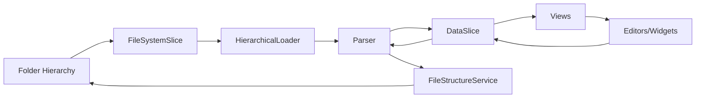
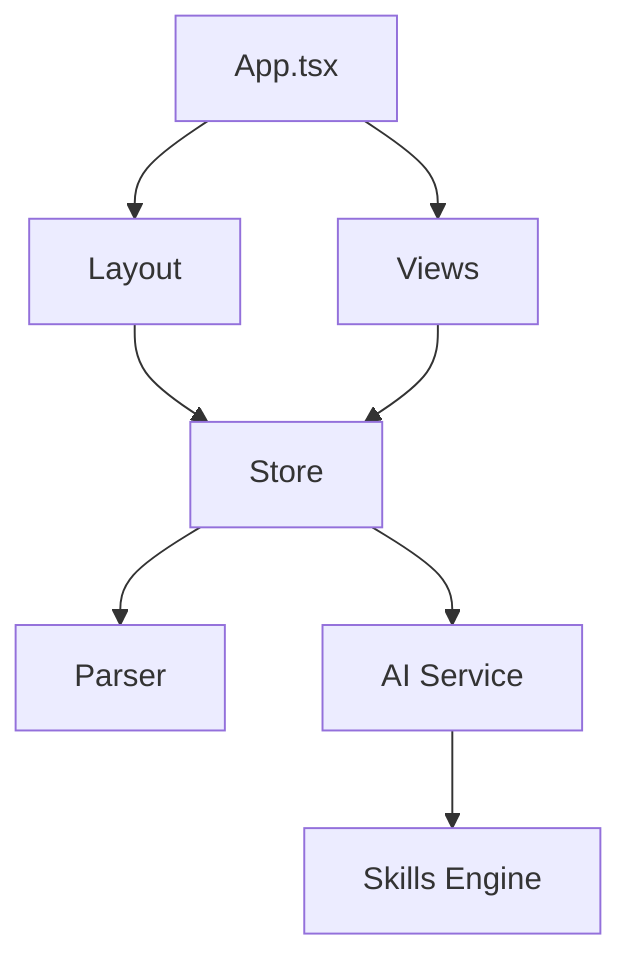

# Project Structure

Overview of the iNNfo codebase organization.

## Directory Tree

```
iNNfo/
├── public/                       # Static assets
│   ├── docs/                     # Documentation (served via DocumentationView)
│   ├── skills/                   # AI skills definitions
│   └── logo.png                  # Application logo
├── src/                          # Source code
│   ├── apps/                     # Application entry points
│   │   ├── main/                 # Main application
│   │   │   ├── App.tsx           # Main app component
│   │   │   └── main.tsx          # Main entry point
│   │   └── viewer/               # Standalone viewer app
│   │       ├── ViewerApp.tsx     # Viewer component
│   │       └── main.tsx          # Viewer entry point
│   ├── components/               # React components
│   │   ├── ai/                   # AI-related components
│   │   ├── common/               # Shared components
│   │   ├── dashboard/            # Dashboard components
│   │   ├── editors/              # Entity editors
│   │   ├── modals/               # Modal dialogs
│   │   ├── navigation/           # Navigation components
│   │   ├── panels/               # Side panels
│   │   ├── ui/                   # Base UI primitives (shadcn/ui)
│   │   ├── views/                # Main application views
│   │   └── widgets/              # Relationship widgets
│   ├── store/                    # Zustand state management
│   │   ├── slices/               # State slices
│   │   │   ├── data/             # Data slice modules
│   │   │   └── *.ts              # Individual slices
│   │   ├── selectors/            # Memoized selectors
│   │   ├── index.ts              # Store initialization
│   │   └── types.ts              # State type definitions
│   ├── services/                 # Core services
│   │   ├── hierarchicalLoader.ts # Distributed model loading
│   │   ├── parser.ts             # .iNNfo.md parser
│   │   ├── fileSystemAccess.ts   # File system API
│   │   └── fileStructureService.ts # File operations
│   ├── lib/                      # External integrations
│   │   └── ai/                   # AI service and skills
│   ├── utils/                    # Pure utility functions
│   ├── hooks/                    # Custom React hooks
│   ├── types/                    # Global TypeScript definitions
│   └── index.css                 # Global styles and Tailwind
├── Sample/                       # Sample Beatles model
├── index.html                    # Main app HTML template
├── viewer.html                   # Viewer app HTML template
├── package.json                  # Dependencies and scripts
├── vite.config.ts                # Main app Vite config
├── vite.viewer.config.ts         # Viewer app Vite config
└── tsconfig.json                 # TypeScript configuration
```

## Core Directories

### `/src/apps/`

Application entry points for different builds.

#### `/main/`

Main iNNfo application with full editing capabilities.

| File       | Purpose                          |
| ---------- | -------------------------------- |
| `App.tsx`  | Main app shell and view routing |
| `main.tsx` | React app initialization         |

#### `/viewer/`

Standalone CMS-style viewer for read-only model browsing.

| File            | Purpose                      |
| --------------- | ---------------------------- |
| `ViewerApp.tsx` | Viewer component             |
| `main.tsx`      | Viewer app initialization    |

### `/src/components/`

React components organized by functional area.

#### `/common/`

Foundational UI elements and application shell components.

| File                     | Purpose                                           |
| ------------------------ | ------------------------------------------------- |
| `Layout.tsx`             | Main shell with navigation and view switching     |
| `FolderSelector.tsx`     | Folder picker and model management                |
| `HierarchyNavigator.tsx` | File system tree navigation                       |
| `DetailModal.tsx`        | Unified detail panel for nodes                    |
| `MermaidRenderer.tsx`    | High-performance Mermaid diagram rendering        |
| `EmptyModelState.tsx`    | Landing state when no model is active             |

#### `/views/`

Top-level page components for each application mode.

| File                    | Purpose                                      |
| ----------------------- | -------------------------------------------- |
| `NavigatorView.tsx`     | Unified file system and instance explorer    |
| `MatrixView.tsx`        | Relationship management grid                 |
| `MetamodelView.tsx`     | Class diagram and metamodel visualization    |
| `SourceImportView.tsx`  | Document ingestion and AI extraction         |
| `SkillsDashboard.tsx`   | AI skill management and configuration        |
| `HistoryView.tsx`       | Model change history and audit log           |
| `DebugView.tsx`         | Developer debugging and inspection tools     |
| `DocumentationView.tsx` | Documentation reader interface               |
| `SettingsView.tsx`      | Application settings and preferences         |

#### `/editors/`

Specialized editors for different entity types.

| File                       | Purpose                              |
| -------------------------- | ------------------------------------ |
| `UnifiedEntityContent.tsx` | Main entity editor with tabs         |
| `EditorProperties.tsx`     | Property editing interface           |
| `EditorContent.tsx`        | Markdown content editor              |
| `EditorRelationships.tsx`  | Relationship graph editor            |
| `EditorFiles.tsx`          | File attachment management           |

### `/src/store/`

Centralized state management using Zustand and Immer.

| Directory/File | Purpose                                         |
| -------------- | ----------------------------------------------- |
| `slices/`      | Modular slices (Data, UI, FileSystem, AI, etc.) |
| `slices/data/` | Data slice sub-modules (nodes, relationships)   |
| `selectors/`   | Memoized selectors for derived state            |
| `index.ts`     | Combined store hook and initialization logic    |
| `types.ts`     | State-specific TypeScript interfaces            |

### `/src/services/`

Core services for file system, parsing, and model loading.

| File                      | Purpose                                      |
| ------------------------- | -------------------------------------------- |
| `hierarchicalLoader.ts`   | Recursive `.iNNfo.md` file loading           |
| `parser.ts`               | Bidirectional parser for `.iNNfo.md` format  |
| `fileSystemAccess.ts`     | Browser File System Access API wrapper       |
| `fileStructureService.ts` | File and folder operations                   |

### `/src/lib/`

Heavy-lifting logic and external integrations.

| File/Directory | Purpose                                      |
| -------------- | -------------------------------------------- |
| `ai/`          | Google Gemini API integration and skills     |
| `ai/skills/`   | Skill loading and execution engine           |
| `ai/protocol/` | AI protocol types and definitions            |

## Configuration Files

### `package.json`
- Dependencies and dev dependencies
- npm scripts (`dev`, `build`, `lint`, `preview`)
- Project metadata

### `tsconfig.json`
- TypeScript compiler options
- Includes `tsconfig.app.json` and `tsconfig.node.json`

### `vite.config.ts`
- Vite build configuration
- React plugin setup
- Base path for deployment

### `tailwind.config.js`
- Tailwind CSS configuration
- Custom theme extensions
- Plugin configurations

### `eslint.config.js`
- ESLint rules
- TypeScript ESLint integration
- React-specific linting

### `postcss.config.js`
- PostCSS plugins
- Tailwind CSS processing

## Key Files

### Entry Points

| File           | Purpose                                  |
| -------------- | ---------------------------------------- |
| `index.html`   | HTML template, app title, root div       |
| `src/main.tsx` | React app initialization, renders `App`  |
| `src/App.tsx`  | Main app component, view routing, layout |

### Styling

| File            | Purpose                            |
| --------------- | ---------------------------------- |
| `src/index.css` | Global styles, Tailwind directives |
| `src/App.css`   | App-specific styles                |

## Data Flow



1. **Load:** Folder → FileSystemSlice → HierarchicalLoader → Parser → DataSlice → Views
2. **Edit:** Interaction → DataSlice → Views
3. **Save:** DataSlice → Parser → FileStructureService → Folder

### Loading Workflow

1. **User Action:** Select Folder via File System Access API
2. **FileSystemSlice:** Store handle and initiate loading
3. **HierarchicalLoader:** Recursively scan folder hierarchy
4. **Parser:** Parse each `.iNNfo.md` file
5. **DataSlice:** Populate store with metamodel, nodes, and relationships
6. **UI:** Trigger re-render of active view

### Saving Workflow

1. **User Edit:** Modify node or relationship
2. **DataSlice:** Update state immutably via Immer
3. **Auto-save:** Debounced save trigger
4. **Parser:** Serialize state to `.iNNfo.md` format
5. **FileStructureService:** Write files to disk
6. **Confirmation:** Toast notification on success

## Module Dependencies



## Build Output

### Development (`npm run dev`)
- Served from memory
- Source maps enabled
- Hot Module Replacement (HMR)

### Production (`npm run build`)
```
dist/
├── assets/
│   ├── index-[hash].js      # Bundled JavaScript
│   ├── index-[hash].css     # Bundled CSS
│   └── [asset]-[hash].[ext] # Hashed assets
├── index.html               # Entry HTML
└── [public files]           # Copied from public/
```

## Code Organization Principles

### 1. Separation of Concerns
- **Components:** UI only
- **Store:** State management
- **Parser:** File I/O
- **Types:** Data structures

### 2. Single Responsibility
Each file has one clear purpose.

### 3. Reusability
Common components (`ItemBadge`, `MatrixCell`) used across views.

### 4. Type Safety
All data structures defined in `types.ts`, used throughout.

### 5. Modularity
Features can be added/removed independently (e.g., new widgets).

## Naming Conventions

### Files
- **Components:** PascalCase (e.g., `ItemBadge.tsx`)
- **Utilities:** camelCase (e.g., `parser.ts`)
- **Types:** camelCase (e.g., `types.ts`)
- **Styles:** kebab-case or camelCase (e.g., `App.css`)

### Components
- **Functional components:** PascalCase
- **Hooks:** `use` prefix (e.g., `useStore`)
- **Props interfaces:** `[ComponentName]Props`

### Variables
- **camelCase:** Most variables
- **UPPER_SNAKE_CASE:** Constants
- **PascalCase:** Types, interfaces, classes

## Import Patterns

### Alias Imports
Uses `@/` for `src/` to avoid fragile relative paths:

```typescript
import { useStore } from '@/store';
import { parser } from '@/lib/parser';
```

### Barrel Exports
Not used. Import directly from files.

## Testing Structure (Future)

```
app/
├── src/
│   └── __tests__/
│       ├── components/
│       ├── core/
│       └── lib/
```

## Documentation Updates

Update this document when:
- New top-level directories are added to `src/`
- Major component categories are reorganized
- The state management pattern changes
