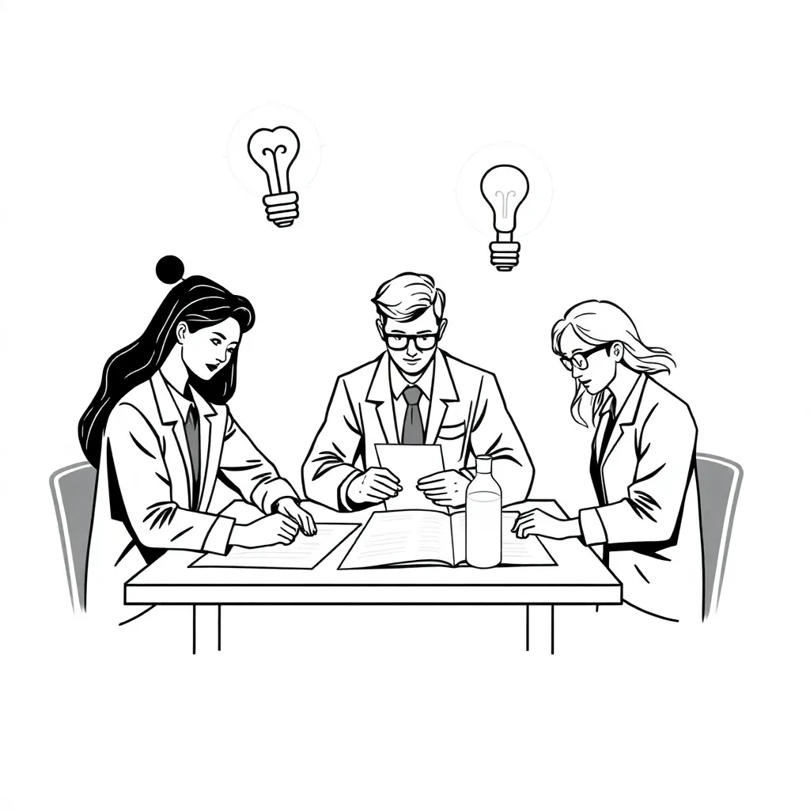
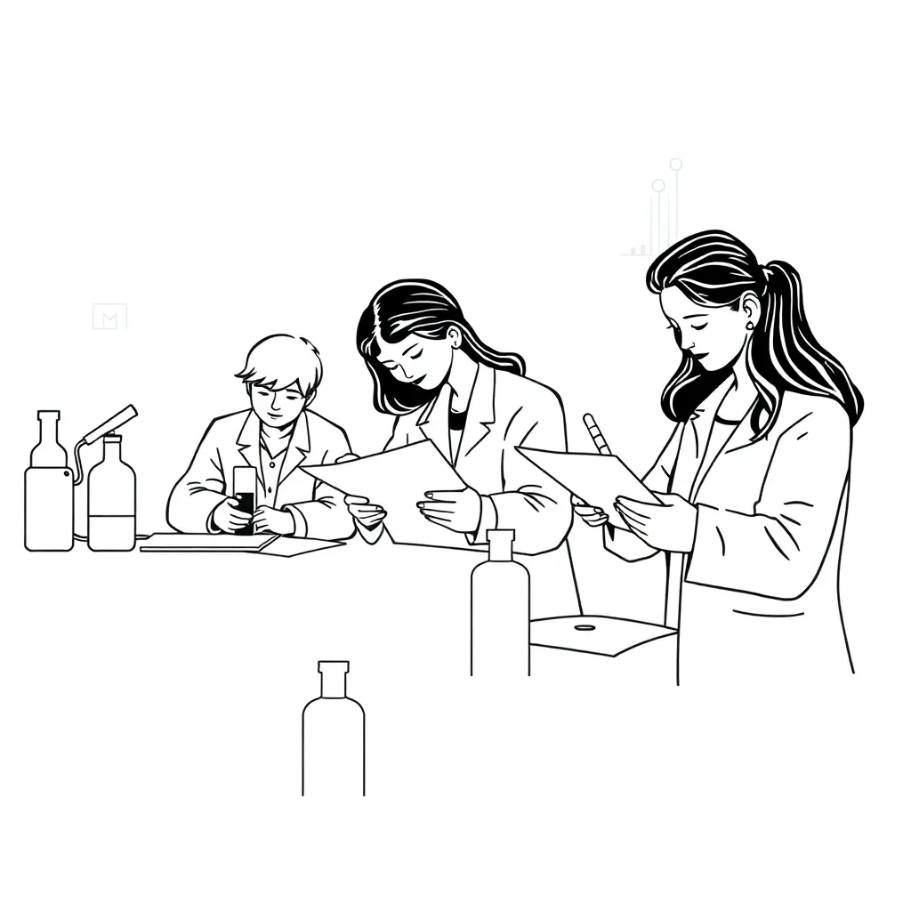
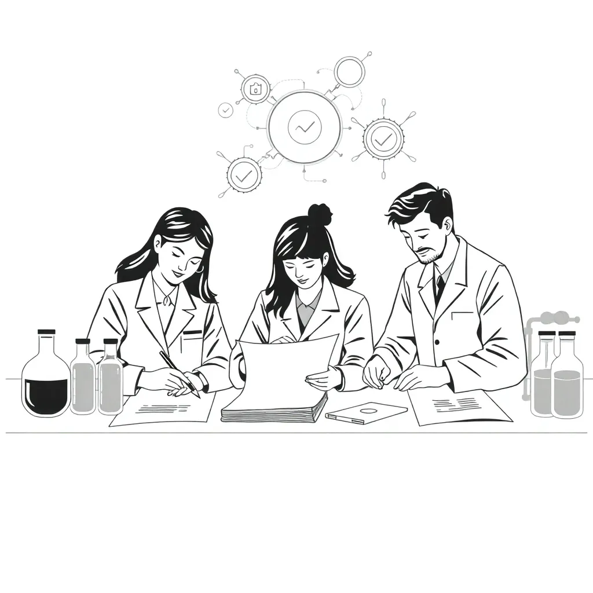
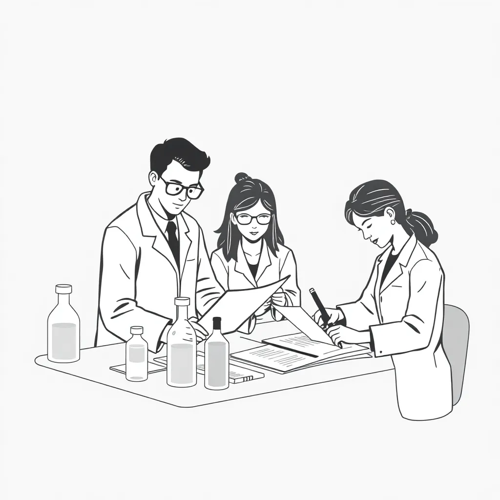

[[innV0]]

## Site Navigation / Header

Lab

## Hero Section

 Innovation Kick-off Program

Structured methodology to guide you from zero to validated prototype

Contact

## Value Proposition

A step-by-step innovation framework: We provide a repeatable, proven sequence of phases so you never wonder what to tackle next

## Our Phases

Identification: Systematically uncover unmet needs, market gaps, and strategic opportunities.

Evaluation & Ranking: Score ideas against real-world criteria (feasibility, impact, effort) to prioritize the most promising.

Prototyping: Build low-fidelity mock-ups that allow fast learning without heavy investment.

Validation: Test prototypes with actual users or stakeholders and collect actionable feedback.

Deployment Plan: Apply insights to enhance the solution, reduce risk, and prepare for deployment and scaling.

## Solution Structure

Modular Work Units: Self-contained building blocks you can plug into existing workflows or run as standalone sprints

Inputs: Key documents, concepts, and tools such as strategic plans, customer personas, and ideation templates

Tasks:

Autonomous exercises: Pre-recorded videos and guided worksheets for self-paced work

Guided workshops: Live or virtual sessions led by our innovation coaches to deepen learning and collaboration

Outputs: Tangible deliverables like opportunity maps, idea scorecards, prototype schematics, and user-test summaries

## Our Process Flow

We provide minimalist educational content to ensure clients grasp concepts before activities to maximize workshop efficiency with a shared vocabulary. This includes pre-session short clips (3–5 minutes) explaining core concepts, best practices, and case studies, as well as one-page briefs summarizing definitions, frameworks, and activity instructions.

### Self-Diagnostic (AI-Guided)

Method: Online chatbot questionnaire that assesses current innovation capabilities and mindset

Focus: Measures risk tolerance, leadership buy-in, resource allocation, failure mindset, etc., and generates a personalized report highlighting strengths and gaps

### Initial Diagnosis

Method: Facilitated discovery session where stakeholders map out existing processes, pain points, and potential quick wins

Deliverable: Current State & Opportunity Map – a visual chart showing high-impact areas to address first

### Idea Generation & Evaluation

Activities: Guided brainstorming (e.g., SCAMPER, How-Might-We) followed by weighted scoring of ideas

Deliverable: Ranked Idea Backlog with rationale and estimated benefits for each concept

### Prototype Conceptualization

Method: Rapid design sprint to sketch, decide, and storyboard key features

Deliverables: Low-fidelity mock-ups and user journey sketches to illustrate core experiences

### Validation & Feedback

Activities: User interviews and usability tests to capture quantitative and qualitative data

Deliverable: Feedback & Insights Report with actionable recommendations on improvements, pivots, or eliminations

### Iteration & Refinement

Purpose: Continuous improvement through lean cycles to refine prototypes, optimize features, and prepare for pilot launch

Deliverable: Refined Prototype & Next Steps Plan outlining final mock-ups and a roadmap for scaling

## Integration with Best-Practice Methodologies

24 Steps of Disciplined Entrepreneurship: End-to-end framework for building a scalable venture from idea to launch

Lean Startup: Build–Measure–Learn cycles emphasizing quick experiments and data-driven decisions

Running Lean: Rapid hypothesis validation to align teams on assumptions, risks, and metrics

Design Thinking: Empathize → Define → Ideate → Prototype → Test for human-centered solutions

## Key Benefits

Clarity: Defined path eradicates confusion and aligns teams

Speed: Jump from zero to prototype in weeks, not months

Risk Mitigation: Test assumptions early to reduce costly missteps

Empowerment: Builds client capability through guided autonomy and learning

## Clients

Allocated innovation budget: Companies that have dedicated funding for R&D or innovation initiatives

Desire for structured innovation: Organizations looking for a clear process to manage their innovation efforts effectively.

Awareness of the need to innovate: Teams that recognize stagnation risks and are motivated to adopt new approaches

No established innovation process: Organizations lacking internal frameworks, templates, or experience to systematically innovate

## Case Example

### Mid-Sized Event Company (40 Employees)

Profile: Overwhelmed with manual processes yet eager to innovate without derailing operations

Application Steps:

AI Self-Diagnostic Chatbot identifies lack of formal process and moderate risk aversion

Initial Diagnosis Workshop uncovers scheduling chaos and manual speaker coordination

Idea Workshop Generates concepts like speaker-management dashboard and email automation

Prototype Sprint Designs wireframes for dashboard and automated flow in one day

Validation Conducts usability tests with staff and a pilot cohort of attendees, gathering NPS and task-completion data

Iterations Refines UI elements and workflow logic; simplifies onboarding steps

Outcome: Pilot tool saves 30 % of planning time and increases on-time communications by 80 %

Insights: Leadership will fund full rollout after seeing pilot ROI and show openness to external tech partnerships, preferring small-scale pilots before enterprise-wide changes

