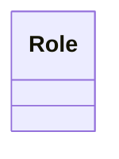

# Using the AI Assistant

NN Modeler features a powerful AI Assistant powered by Google Gemini. It can help you build models, generate documentation, and suggest relationships.

## Setup

1. Click the **AI** button in the bottom right corner.
2. Enter your **Google Gemini API Key**.
   - You can get a key from [Google AI Studio](https://aistudio.google.com/).
   - The key is stored locally in your browser and is never sent to our servers.

## API Usage & Pricing

> [!WARNING]
> **Information Status (2025-12-14)**
> The information regarding pricing, limits, and terms below is accurate as of December 2025. Google may update their policies at any time.
> **Please always verify the latest details on the [official Google AI Studio pricing page](https://ai.google.dev/pricing).**

### API Specifications
This application handles your requests using the **Google Gemini API**:
- **Text Models:** `gemini-2.5-flash` (standard), `gemini-2.0-flash`.
- **Image Models:** `imagen-4.0-generate-001` (standard), `imagen-4.0-ultra-generate-001` (ultra), `imagen-4.0-fast-generate-001` (fast).

### Conditions & Privacy
- **Direct Connection:** Your browser connects directly to Google's servers. No intermediate server from this application processes your data.
- **Terms:** Usage is subject to the [Google Generative AI Terms of Service](https://policies.google.com/terms).

### Pricing & Quotas
Google AI Studio provides a **Free Tier** that is generally sufficient for individual use of this application.
- **Limits:** There are daily limits on tokens and requests per minute (RPM).
- **Billing:** If you need higher quotas, you can enable pay-as-you-go billing in the Google Cloud Console.

## Capabilities

The AI Assistant is context-aware. It "sees" your current Metamodel and Model structure, allowing it to make relevant suggestions.

### 1. Generating Structure
You can ask the AI to create entire branches of your model.

**Prompt:**
> "Create a breakdown of tasks for building a login system."

**Result:**
The AI will generate a hierarchy of tasks (e.g., "Design DB", "Create API", "Frontend Form") and add them to your model under the appropriate parent.

### 2. Suggesting Relationships
The AI can infer relationships based on the node names and your metamodel rules.

**Prompt:**
> "Connect the frontend tasks to the 'Frontend Team' role."

**Result:**
The AI will create `assigned_to` relationships (or whatever your metamodel defines) between the relevant tasks and the person/role.

### 3. Writing Documentation
This is one of the most powerful features. The AI can write detailed descriptions for your nodes.

**Prompt:**
> "Write documentation for the 'Authentication API' task explaining the security requirements."

**Result:**
The AI will populate the **Documentation** tab of that node with a structured Markdown document covering security protocols, endpoints, etc.

## Prompting Tips

To get the best results, be specific and use the terminology defined in your metamodel.

- **Be Specific about Types**: "Add a new **Task** called..." instead of just "Add a thing..."
- **Reference Existing Nodes**: "Add a child to **[[Project Alpha]]**..."
- **Define the Goal**: "I need to model a **workflow** for..."

## Example Workflow

1. **Define Metamodel**: You have `Task` and `Person` classes.
2. **Initial Prompt**: "Create a project plan for a new website launch."
   - *AI generates a tree of tasks.*
3. **Refine**: "Add a 'QA Phase' with 3 testing tasks."
   - *AI adds the new phase.*
4. **Connect**: "Assign all testing tasks to [[Alice]]."
   - *AI creates the relationships.*
5. **Document**: "Add detailed requirements to the 'Homepage Design' task."
   - *AI writes the documentation.*

## How the AI Understands Your Metamodel

The AI Assistant has deep knowledge of your metamodel structure:

### **Class Descriptions**
If you've added `@description` annotations to your metamodel classes, the AI will use them to:
- Understand the semantic meaning of each class
- Suggest appropriate node types for your requests
- Propose logical hierarchies and groupings

Example:


### **Extended Documentation**
If you've created first-level nodes (e.g., `[[Role]]`, `[[Task]]`) with detailed documentation, the AI will:
- Reference these when making suggestions
- Use your terminology and conventions
- Align proposals with your domain model

See [Modeling Best Practices](modeling-best-practices.md) for guidance on documenting your metamodel.

## Bulk Node Creation Workflow

When you ask the AI to create multiple nodes from a document or description, it follows a smart workflow:

### **1. Analysis**
The AI identifies:
- How many nodes of each type need to be created
- Whether they form logical groups
- What the appropriate parent nodes should be

### **2. Proposal with Options**
Instead of immediately creating nodes, the AI will present options:

```
I've identified:
- 3 Role nodes: Submodule Manager, Master Manager, Collaborator
- 5 Task nodes: MODIFY AND COMMIT, PUBLISH SUBMODULE, etc.

Based on your metamodel:
- Role: Represents a role with specific responsibilities
- Task: Represents a task or activity to be performed

Would you like me to:
A) Group them hierarchically (e.g., 'Roles' → 3 roles, 'Workflow' → 5 tasks)
B) Create them all at the same level under their class nodes
C) Let you specify the exact structure
```

### **3. Confirmation**
The AI waits for your choice before proceeding.

### **4. Execution**
Once you confirm, the AI creates the nodes according to your preference.

**Benefits:**
- You maintain control over the structure
- The AI leverages your metamodel knowledge
- Reduces the need for manual reorganization


## Troubleshooting

- **"AI blocked the response" / "Safety Filters"**: Google applies strict safety policies. If an image is not generated, it is likely because the prompt was flagged for:
    - **Violent or Gore content**
    - **Sexually explicit content**
    - **Harassment or Hate Speech**
    - **Copyrighted characters or public figures**

- **"Invalid API Key"**: Check that you copied the key correctly and that it has quota available.
- **"Quota Exceeded"**: Image generation (Imagen 4) is computationally expensive. If you receive a 429 error, you may need to enable billing in your Google Cloud Console.
- **Unexpected Results**: The AI might misunderstand your metamodel if class names are ambiguous. Try to use clear, distinct names for your classes.
