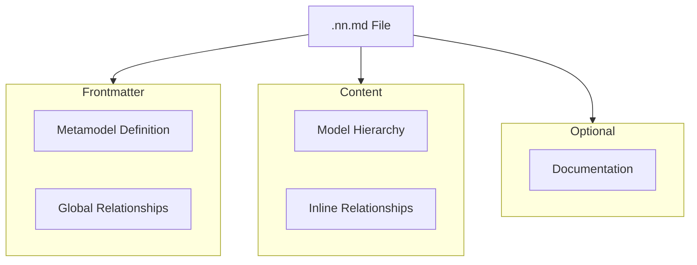

# The .nn.md File Format

Complete specification of the NN Modeler file format.

## Overview

`.nn.md` files are Markdown documents with embedded Mermaid diagrams that define both the structure (metamodel) and content (model instances and relationships) of a domain model.

## File Structure



## File Structure

```markdown
---
version: "0.2.0"
metamodel:
  classes:
    ...
  relationships:
    ...
graph_edges:
  - from: Node A
    to: Node B
    label: relates_to
---

# [Model Title]

## Model
[Logseq-style outline]

- [[Node A]]
    - [[Node B]]

## Documentation
[Optional Markdown docs]
```

The **Frontmatter** and **Model** sections are required.

All sections are **required** except Documentation.

## Section 1: Frontmatter

The frontmatter defines the metamodel and global relationships using YAML.

### Metamodel Structure

```yaml
metamodel:
  classes:
    Work:
      lucideIcon: CheckSquare
      color: blue
      description: Use plain English
  relationships:
    - from: Work
      to: Object
      label: input
      widget: text
      config:
         multiline: true
```

### Class Definition Properties
- `lucideIcon`: Icon name from Lucide library
- `emoji`: Fallback emoji
- `color`: Tailwind color name
- `description`: Helper text

### Relationship Definition Properties
- `from`: Source class name
- `to`: Target class name
- `label`: Relationship identifier
- `widget`: Widget type (`binary`, `scale`, `set`, `cycle`, `number`, `text`, `mermaid`)
- `config`: Widget-specific configuration object

### Widget Types and Configs

#### Binary
```yaml
widget: binary
config:
  trueLabel: Yes
  falseLabel: No
```

#### Scale
```yaml
widget: scale
config:
  min: 1
  max: 10
```

#### Set
```yaml
widget: set
config:
  options: [Option A, Option B]
```

#### Cycle
```yaml
widget: cycle
config:
  values: [Todo, Doing, Done]
```

#### Number
```yaml
widget: number
config:
  min: 0
  format: currency
```

#### Text
```yaml
widget: text
config:
  multiline: true
```

## Section 2: Model

Hierarchical outline of model instances using Logseq-style syntax.

### Syntax

```markdown
## Model

- [[ClassName1]]
    - [[Instance1]]
        - [[NestedInstance]]
    - [[Instance2]]
- [[ClassName2]]
    - [[Instance3]]
```

**Rules:**
- Use `-` or `*` for list items
- Indent with 4 spaces or 1 tab per level
- All node names MUST be in `[[double brackets]]`
- First level should be class names from metamodel
- Subsequent levels are instances

### Node Naming

- **Unique:** Each `[[Node Name]]` must be unique
- **Descriptive:** Use clear names
- **Spaces allowed:** `[[My Task Name]]` is valid
- **Avoid:** `|`, `#`, `@` characters

### Hierarchy

```
- [[Work]]              ← Class (type: "Work")
    - [[Task 1]]        ← Instance (type: "Work", inferred from parent)
        - [[Subtask]]   ← Nested instance (type: "Work")
    - [[Task 2]]        ← Instance (type: "Work")
```

## Section 3: Instance Relationships

Relationships between instances can be defined in two ways:

### 1. Global Relationships (YAML)

Defined in the `graph_edges` section of the frontmatter. Preferred for robustness.

```yaml
graph_edges:
  - from: Node A
    to: Node B
    label: assigned_to
    value: Alice
```

### 2. Inline Relationships (Outline)

Defined directly in the `## Model` section using `::` syntax.

```markdown
- [[Node A]]
    - [[Node B]]
        assigned_to:: [[Alice]]
        priority:: 5
```

### Syntax Rules

- **Inline Property**: `relationship_label:: [[Target Node]]` or `relationship_label:: Value`
- **Target Node**: Must typically be a `[[wikilink]]` for connections
- **Value**: Can be a literal value for data properties

### Value Formats per Widget

| Widget | Format            | Example                     |
| ------ | ----------------- | --------------------------- |
| Binary | `true` or `false` | `is_critical:: true`        |
| Scale  | Number            | `impact:: 7`                |
| Set    | Option string     | `priority:: High`           |
| Cycle  | Value string      | `status:: In Progress`      |
| Number | Number            | `budget:: 50000`            |
| Text   | String            | `notes:: This is important` |


## Section 4: Documentation (Optional)

Detailed Markdown documentation for specific nodes using Logseq-style format.

### Syntax

```markdown
## Documentation

### [[Node Name]]
type:: nn-documentation

[Markdown content]

### [[Another Node]]
type:: nn-documentation

[More content]
```

**Rules:**
- Use `### [[Node Name]]` as heading (H3 level)
- Add `type:: nn-documentation` property on the next line
- Node name must match Model section exactly
- Content after the property line is full Markdown (headings, lists, code, links, etc.)
- Multiple paragraphs and headings allowed without restrictions
- Compatible with Logseq and Roam Research
- Standard Markdown format for better interoperability

### Example

```markdown
## Documentation

### [[Design Homepage]]
type:: nn-documentation

# Homepage Design Requirements

## Objectives
- Create modern, responsive homepage
- Align with brand guidelines
- Optimize for conversion

## Key Elements
1. Hero section with CTA
2. Feature highlights
3. Social proof section
4. Footer with links

### Technical Constraints
- Mobile-first design
- Load time < 2 seconds
- WCAG AA compliance

### Resources
- [Brand Guidelines](https://example.com/brand)
- [Wireframes](https://example.com/wireframes)

### [[Another Task]]
type:: nn-documentation

Documentation for another task...
```

## Complete Example

## Complete Example

```markdown
---
metamodel:
  classes:
    Task:
      lucideIcon: CheckSquare
      color: blue
    Person:
      lucideIcon: User
      color: green
  relationships:
    - from: Task
      to: Person
      label: assigned_to
      widget: set
      config:
        options: [Alice, Bob, Charlie]
        allowEmpty: true
    - from: Task
      to: Task
      label: priority
      widget: scale
      config:
        min: 1
        max: 5
    - from: Task
      to: Task
      label: status
      widget: cycle
      config:
        values: [Todo, In Progress, Done]
graph_edges:
  - from: Design Homepage
    to: Alice
    label: assigned_to
  - from: Design Homepage
    to: Design Homepage
    label: priority
    value: 5
  - from: Design Homepage
    to: Design Homepage
    label: status
    value: In Progress
---

# Task Management Model

## Model

- [[Task]]
    - [[Design Homepage]]
    - [[Implement Login]]
        - assigned_to:: [[Bob]]
        - status:: Todo
        - priority:: 4
    - [[Write Tests]]
        - assigned_to:: [[Charlie]]
        - status:: Todo
        - priority:: 3
- [[Person]]
    - [[Alice]]
    - [[Bob]]
    - [[Charlie]]
```

## Documentation

### [[Design Homepage]]
type:: nn-documentation

# Homepage Design Task

Create a modern, responsive homepage that aligns with our brand guidelines.

## Requirements
- Mobile-first design
- Hero section with CTA
- Feature highlights
- Load time < 2s

## Deliverables
- Figma designs
- HTML/CSS implementation
- Responsive breakpoints
```

## Validation Rules

### Metamodel
- ✅ At least one class defined
- ✅ Valid Mermaid syntax
- ✅ Widget types are valid
- ✅ Configs match widget requirements

### Model
- ✅ All nodes have `[[brackets]]`
- ✅ Consistent indentation
- ✅ First-level nodes match classes

### Relationships
- ✅ Source/target nodes exist in Model
- ✅ Labels exist in Metamodel
- ✅ Values match widget types

## Parser Behavior

### Error Handling
- Invalid widget → defaults to `text`
- Missing config → uses defaults
- Invalid relationship → skipped with warning
- Malformed Mermaid → section ignored

### Type Inference
- First-level nodes: Type = class name
- Child nodes: Type inherited from parent
- If parent is also a class, child gets that type

## Best Practices

1. **Consistent Naming** - Use clear, unique node names
2. **Logical Hierarchy** - Structure reflects domain relationships
3. **Appropriate Widgets** - Match widget to data type
4. **Complete Configs** - Always provide required config options
5. **Documentation** - Document complex or important nodes
6. **Version Control** - Commit `.nn.md` files to Git

## File Extensions

- **Preferred:** `.nn.md`
- **Alternative:** `.md` (but less discoverable)

## Character Encoding

- **UTF-8** encoding required
- Supports Unicode emojis and international characters

## Line Endings

- **Unix (LF):** Recommended
- **Windows (CRLF):** Supported
- **Mac (CR):** Supported

## Updates

Update this specification when:
- New widget types are added
- Syntax rules change
- New sections are introduced
- Parser behavior changes
