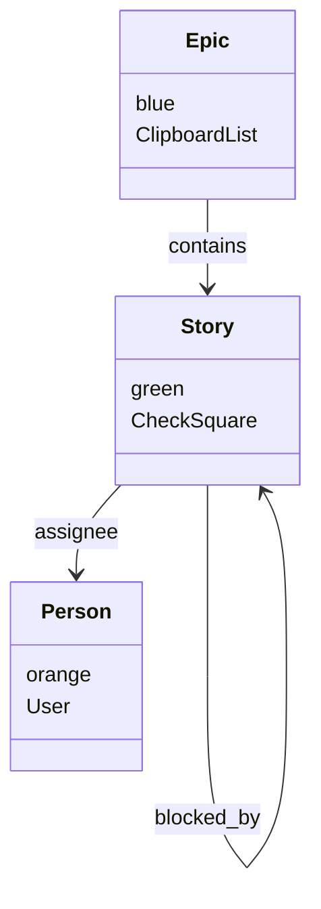

# Defining Metamodels

The metamodel is the foundation of your NN Modeler project. It defines the "language" you will use to describe your domain.

## Overview

A metamodel consists of:
1. **Classes**: The types of objects in your system (e.g., `Task`, `Person`, `Component`).
2. **Relationships**: How these objects can connect (e.g., `assigned_to`, `depends_on`).
3. **Widgets**: How users interact with these relationships (e.g., `set`, `scale`).
4. **Visuals**: Icons and colors to distinguish classes.

The metamodel is defined in the **YAML Frontmatter** at the top of your `.nn.md` file.

## Class Definition

Define classes in the `metamodel.classes` section of the frontmatter.

```yaml
---
metamodel:
  classes:
    Product:
      # Visuals (Unified)
      icon: Box
      color: blue
      description: Represents a product in the inventory system
      
      # Data Schema
      attributes:
        price:
          type: number
          config: { min: 0 }
        category:
          type: set
          config: { options: [Electronics, Furniture] }
---
```

### Unified Configuration
In the **Unified Metamodel**, everything related to the class is defined under its key:

1.  **Visuals**: `icon`, `color`, `emoji` (determines how it looks).
2.  **Schema**: `attributes` (determines what data it holds).
3.  **AI**: `prompts`, `description`, `agents` (determines how AI interacts with it).

**Available Colors:**
`blue`, `green`, `red`, `yellow`, `purple`, `pink`, `indigo`, `gray`, `orange`, `teal`, `cyan`

## Relationship Definition

Relationships define the rules for connecting instances. They are defined in the `metamodel.relationships` list.

### Syntax

```yaml
metamodel:
  relationships:
    - from: SourceClass
      to: TargetClass
      label: relationship_label
      cardinality: "1..*"
      widget: widget_type
      config:
        key: value
```

**Example:**
```yaml
metamodel:
  relationships:
    - from: Task
      to: Person
      label: assigned_to
      widget: set
      config:
        options: [Alice, Bob, Charlie]
```

### Components

1. **from**: Source Class
2. **to**: Target Class
3. **label**: A unique identifier for the relationship (e.g., `assigned_to`)
4. **cardinality** (optional): e.g., `"1"`, `"0..*"`
5. **widget**: The widget type to use for editing
6. **config**: Configuration object for the widget

### Cardinality Notation

- `"1"`: Exactly one
- `"0..1"`: Zero or one
- `"0..*"`: Zero or more
- `"1..*"`: One or more
- `"*"`: Any number

*Note: Cardinality is for documentation purposes only and is not enforced by the application.*

## Widget Configuration

Widgets determine how you edit relationships in the Matrix View.

### Common Configurations

**Binary (Yes/No)**
```yaml
- from: Task
  to: Task
  label: critical
  widget: binary
```

**Scale (1-N)**
```yaml
- from: Task
  to: Task
  label: priority
  widget: scale
  config:
    min: 1
    max: 5
```

**Set (Options)**
```yaml
- from: Task
  to: Person
  label: owner
  widget: set
  config:
    options: [Alice, Bob]
```

**Cycle (Status)**
```yaml
- from: Task
  to: Task
  label: status
  widget: cycle
  config:
    values: [Todo, Doing, Done]
```

See [Widgets Overview](../04-widgets/widgets-overview.md) for full details.

## Advanced Patterns

### Self-Referencing Relationships
Classes can relate to themselves. Useful for hierarchies or dependencies.

```yaml
metamodel:
  relationships:
    - from: Task
      to: Task
      label: subtask_of
      widget: binary
    - from: Task
      to: Task
      label: blocks
      widget: binary
```

### Multiple Relationships
You can define multiple relationship types between the same two classes.

```yaml
metamodel:
  relationships:
    - from: Service
      to: Database
      label: reads
      widget: binary
    - from: Service
      to: Database
      label: writes
      widget: binary
    - from: Service
      to: Database
      label: latency
      widget: number
      config:
        min: 0
```

### Abstract/Base Classes (Simulation)
While NN Modeler doesn't support true inheritance yet, you can simulate it by using a generic class and differentiating via relationships.

```yaml
- from: Item
  to: Item
  label: type
  widget: set
  config:
    options: [Feature, Bug, Chore]
```

## Best Practices

1. **Start Simple**: Begin with 2-3 core classes and expand as needed.
2. **Use Semantic Colors**: Use colors consistently (e.g., Red for risks/bugs, Green for people/resources).
3. **Clear Labels**: Use verb phrases for relationship labels (`assigned_to`, `managed_by`).
4. **Consistent Icons**: Choose icons that are easily recognizable at small sizes.
5. **Validate Configs**: Ensure all widget configs are valid JSON-like syntax (no quotes on keys).

## Example: Project Management Metamodel

```yaml
---
metamodel:
  classes:
    Epic:
      lucideIcon: ClipboardList
      color: blue
      description: Represents a large feature or initiative containing multiple stories
    Story:
      lucideIcon: CheckSquare
      color: green
      description: Represents a user story or work item to be completed
    Person:
      lucideIcon: User
      color: orange
      description: Represents a team member or stakeholder
  relationships:
    - from: Epic
      to: Story
      label: contains
      widget: binary
    - from: Story
      to: Person
      label: assignee
      widget: set
      config:
        options: [Dev1, Dev2]
    - from: Story
      to: Story
      label: blocked_by
      widget: binary
    - from: Story
      to: Story
      label: points
      widget: number
      config:
        min: 1
        max: 13
---


```
