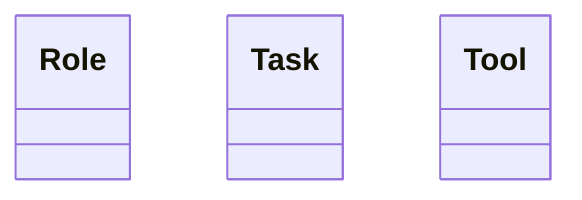

# Modeling Best Practices

This guide covers recommended patterns and practices for organizing your models effectively in NN Modeler.

## Naming Conventions

Clear and consistent naming is the foundation of a readable model. Following these conventions helps the AI Assistant understand your domain better and makes your model easier for others to navigate.

### 1. Class and Entity Naming

| Rule               | Description                                                    | ✅ Good              | ❌ Bad                |
| :----------------- | :------------------------------------------------------------- | :------------------ | :------------------- |
| **Singular Nouns** | Use the singular form for class names to represent the "type". | `[[Task]]`          | `[[Tasks]]`          |
| **PascalCase**     | Capitalize the first letter of each word in a class name.      | `[[StoreCustomer]]` | `[[store_customer]]` |
| **Descriptive**    | Be specific about what the class represents.                   | `[[BacklogItem]]`   | `[[NewItem]]`        |

**Why singular?** It makes relationships read more naturally. For example, `[[Task]] -- "assigned_to" --> [[Person]]` is clearer than `[[Tasks]] -- "assigned_to" --> [[People]]`.

### 2. Physical Attribute Naming

When defining attributes in the metamodel, use **camelCase**.

*   **Standard properties**: `firstName`, `dueDate`, `totalAmount`.
*   **Boolean/Checkbox**: Use prefixes like `is`, `has`, or `can`.
    *   ✅ `isActive`, `hasPermission`, `canEdit`.
*   **Date and ID Suffixes**: Use `At`, `On`, or `Id` to clarify the data type.
    *   ✅ `createdAt`, `startingOn`, `customerId`.

### 3. Avoiding Ambiguity

Avoid generic suffixes that don't add semantic value:
*   ❌ `ProjectData`, `UserInfo`, `TaskObject`.
*   ✅ `Project`, `User`, `Task`.

> [!TIP]
> **Consistency is Key**: Choose a naming style and stick to it across your entire metamodel. This reduces cognitive load and prevents the AI from getting confused about similar concepts.

## Model Organization Patterns

### Hierarchical vs. Flat Structures

Your model can be organized in different ways depending on your needs:

#### **Flat Structure**
All instances are at the same level, typically grouped by class.

```
- [[Task]]
    - [[Design Homepage]]
    - [[Write Tests]]
    - [[Deploy]]
- [[Person]]
    - [[Alice]]
    - [[Bob]]
```

**When to use:**
- Simple models with few instances
- When relationships are more important than hierarchy
- When all instances of a class have equal importance

#### **Tree Structure**
Instances are nested to show containment, composition, or detail relationships.

```
- [[Project]]
    - [[Phase 1: Design]]
        - [[Design Homepage]]
        - [[Design Login]]
    - [[Phase 2: Development]]
        - [[Write Tests]]
        - [[Deploy]]
    - [[Team]]
        - [[Alice]]
        - [[Bob]]
```

**When to use:**
- Complex models with natural hierarchies
- When showing containment or composition is important
- When you need to organize instances into logical groups

### Grouping Rules

When creating multiple instances of the same type, follow these guidelines:

#### **1. Small Sets (1-3 instances)**
Can be placed directly under the class node without additional grouping.

```
- [[Tool]]
    - [[Git]]
    - [[GitHub]]
    - [[VS Code]]
```

#### **2. Medium Sets (4-10 instances)**
Consider grouping under a descriptive parent node.

```
- [[Project]]
    - [[Development Tools]]
        - [[Git]]
        - [[GitHub]]
        - [[VS Code]]
        - [[Docker]]
    - [[Design Tools]]
        - [[Figma]]
        - [[Sketch]]
```

#### **3. Large Sets (10+ instances)**
**Always** group under logical parent nodes, potentially with multiple levels.

```
- [[Organization]]
    - [[Engineering]]
        - [[Frontend Team]]
            - [[Alice]]
            - [[Bob]]
        - [[Backend Team]]
            - [[Charlie]]
            - [[Diana]]
    - [[Design]]
        - [[UX Team]]
            - [[Eve]]
```

### Relationship Types and Hierarchy

Understanding the semantic meaning of parent-child relationships:

#### **Composition (Part-of)**
The child cannot exist without the parent. Deleting the parent should delete children.

```
- [[Car]]
    - [[Engine]]
    - [[Wheels]]
    - [[Transmission]]
```

**Characteristics:**
- Strong ownership
- Lifecycle dependency
- Usually represented by nesting in the model

#### **Aggregation (Has-a)**
The child can exist independently. The parent merely groups or references children.

```
- [[Team]]
    - [[Alice]]  (Alice can exist without the team)
    - [[Bob]]
```

**Characteristics:**
- Weak ownership
- Independent lifecycle
- Can be represented by nesting OR by relationships

#### **Categorization (Is-a-type-of)**
The child is a specialization or instance of the parent category.

```
- [[Task]]
    - [[Development Task]]
    - [[Design Task]]
    - [[Testing Task]]
```

**Characteristics:**
- Classification relationship
- Often better modeled with a relationship property (e.g., `type: Development`)
- Use nesting when the type has specific sub-instances

#### **Detail/Refinement**
The child provides additional detail or breakdown of the parent.

```
- [[Epic: User Authentication]]
    - [[Story: Login Form]]
    - [[Story: Password Reset]]
    - [[Story: OAuth Integration]]
```

**Characteristics:**
- Decomposition relationship
- Parent is abstract, children are concrete
- Common in project management and requirements modeling

## Metamodel Class Documentation

### Adding Semantic Descriptions

Each class in your metamodel should have:

1. **Short Description** (in Mermaid): A one-line explanation
2. **Extended Documentation** (in Model): Detailed explanation as a first-level node

#### **Short Description in Mermaid**

Use the `@description` annotation in your metamodel:



**Purpose:**
- Provides quick context to users and AI
- Appears in tooltips and help text
- Helps the AI Assistant understand your domain

#### **Extended Documentation in Model**

Create first-level nodes matching your class names and add detailed documentation:

```
## Model

- [[Role]]
- [[Task]]
- [[Tool]]

## Documentation

### [[Role]]

A **Role** represents a person or group with specific responsibilities in a workflow or organization.

Roles are used to:
- Define who is responsible for tasks
- Model organizational structure
- Track accountability and ownership

**Examples:**
- Project Manager
- Software Developer
- QA Engineer

**Common Relationships:**
- `assigned_to`: Links tasks to roles
- `reports_to`: Creates organizational hierarchy
- `has_skill`: Associates roles with competencies
```

**Purpose:**
- Provides comprehensive guidance to users
- Helps the AI Assistant make better suggestions
- Documents your modeling conventions
- Serves as onboarding material for new team members

### Benefits for AI Assistant

When your metamodel classes have both short descriptions and extended documentation:

1. **Better Context**: The AI understands the semantic meaning of each class
2. **Smarter Grouping**: The AI can suggest appropriate hierarchies
3. **Accurate Proposals**: The AI creates nodes that align with your domain
4. **Consistent Naming**: The AI uses terminology from your documentation

## AI Assistant Workflow for Bulk Creation

When the AI detects you're creating multiple nodes, it should:

### 1. **Analyze the Request**
Identify:
- How many nodes of each type
- Whether they form a logical group
- What the parent should be

### 2. **Propose Organization**
Present options to the user:

```
I've identified:
- 3 Role nodes: Submodule Manager, Master Manager, Collaborator
- 5 Task nodes: MODIFY AND COMMIT, PUBLISH SUBMODULE, etc.

Based on your metamodel:
- Role: Represents a role with specific responsibilities
- Task: Represents a task or activity to be performed

Would you like me to:
A) Group them hierarchically (e.g., 'Roles' → 3 roles, 'Workflow' → 5 tasks)
B) Create them all at the same level under their class nodes
C) Let you specify the exact structure
```

### 3. **Wait for Confirmation**
Do NOT proceed until the user chooses an option.

### 4. **Execute**
Create the nodes according to the user's preference.

## Common Patterns by Domain

### Project Management
```
- [[Project]]
    - [[Phases]]
        - [[Phase 1]]
        - [[Phase 2]]
    - [[Tasks]]
        - [[Task 1]]
        - [[Task 2]]
    - [[Team]]
        - [[Member 1]]
        - [[Member 2]]
```

### Software Architecture
```
- [[System]]
    - [[Frontend]]
        - [[Component 1]]
        - [[Component 2]]
    - [[Backend]]
        - [[Service 1]]
        - [[Service 2]]
    - [[Database]]
        - [[Table 1]]
        - [[Table 2]]
```

### Process Modeling
```
- [[Process]]
    - [[Roles]]
        - [[Role 1]]
        - [[Role 2]]
    - [[Activities]]
        - [[Activity 1]]
        - [[Activity 2]]
    - [[Artifacts]]
        - [[Artifact 1]]
        - [[Artifact 2]]
```

## Summary

**Key Principles:**
1. Choose flat vs. tree based on your domain needs
2. Group instances when you have 4+ of the same type
3. Understand the semantic meaning of parent-child relationships
4. Document your metamodel classes thoroughly
5. Use `@description` in Mermaid for quick context
6. Create first-level nodes with extended documentation
7. Let the AI Assistant help, but confirm bulk operations

Following these practices will result in models that are:
- Easy to navigate
- Semantically clear
- Well-documented
- AI-friendly
