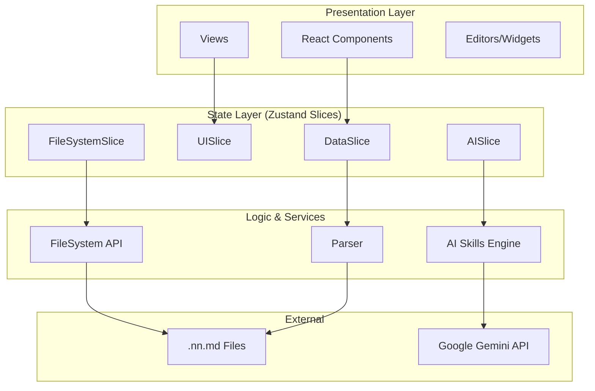
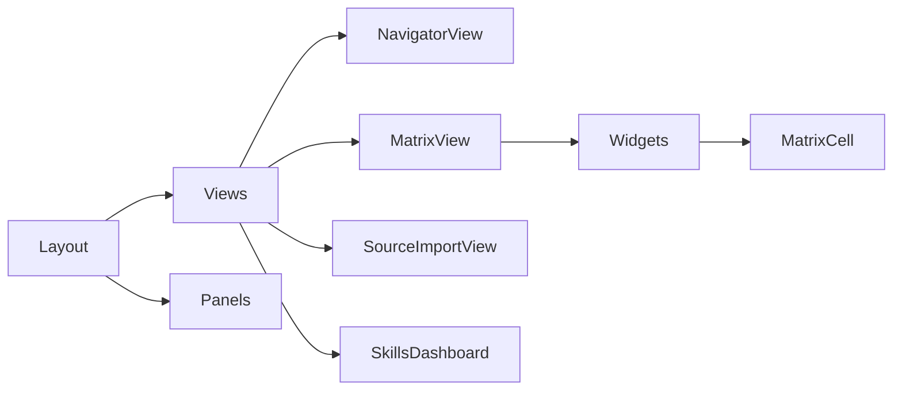
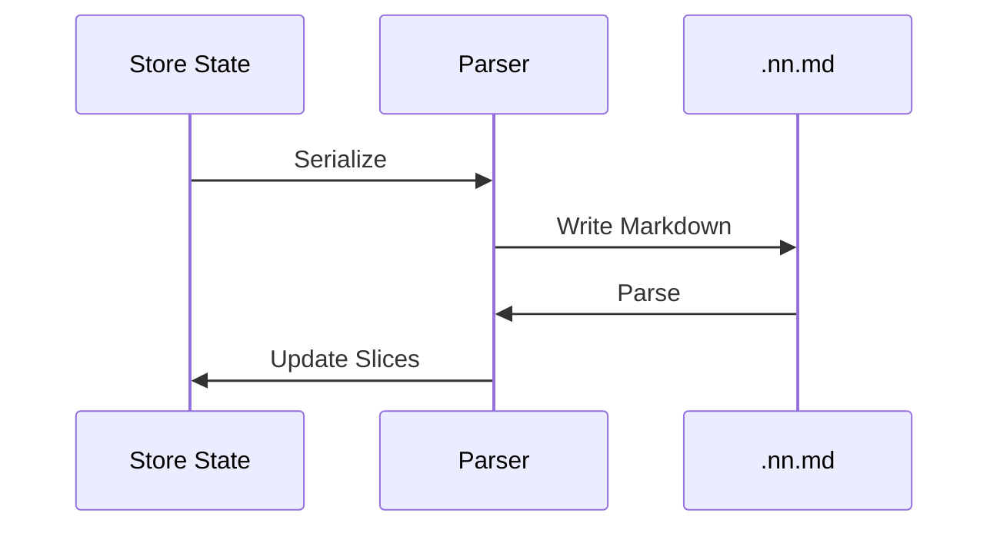

# Architecture

NN Modeler follows a clean, modular architecture built with React, TypeScript, and Zustand.

## System Overview

## Architecture Layers

### 1. Presentation Layer

**Location:** `src/components/`

**Responsibility:** User interface, interaction logic, and visual representation.

**Components:**

**Key Areas:**
- **Views:** Top-level application states (Navigator, Matrix, etc.).
- **Editors:** Granular mutation interfaces (UnifiedEntityContent).
- **Widgets:** Specialized relationship inputs (Binary, Scale, Set).
- **Common:** Shared UI primitives and layout structures.

### 2. State Management Layer

**Location:** `src/store/`

**Responsibility:** Centralized application state and business logic orchestration.

**Technology:** Zustand with Immer for immutable mutations and slice-based composition.

**State Composition:**
- **DataSlice:** Nodes, relationships, and metamodel definitions.
- **UISlice:** View tracking, expansion states, and selection.
- **FileSystemSlice:** Directory handles and file I/O operations.
- **ReviewSlice:** Staging for AI-proposed changes.

### 3. Core Logic & Lib Layer

**Location:** `src/lib/` & `src/utils/`

**Responsibility:** Fundamental computing tasks, data transformation, and service abstraction.

#### Parser (`parser.ts`)
Handles the bidirectional mapping between the internal graph state and the `.nn.md` Markdown format.

#### AI Skills Engine
Decouples AI capabilities from the main application logic, allowing for pluggable and model-specific AI "personas".

### 4. Integration Layer

**Location:** `src/services/` & `src/hooks/`

**Responsibility:** Interfacing with browser APIs and external services.
- **File System Access API:** For direct local folder manipulation.
- **IndexedDB:** For persisting folder handles and app preferences.
- **Google Gemini API:** For generative AI capabilities.

## Data Flow Patterns

### Loading Workflow
1. **User Action:** Select Folder.
2. **FileSystemSlice:** Store handle and list files.
3. **Parser:** Read and parse `nn.md`.
4. **DataSlice:** Populate store with nodes and relationships.
5. **UI:** Trigger re-render of active view.

### AI Proposal Workflow
1. **Prompt:** User interacts via `AIChatPanel`.
2. **AISlice:** Send context + prompt to Gemini.
3. **ReviewSlice:** Capture proposed JSON changes in staging.
4. **User Review:** Approve/Reject changes.
5. **DataSlice:** Commit approved changes to the model.

## Technology Stack

### Core
- **React 19**
- **TypeScript 5.9**
- **Vite 5.4**

### State & Logic
- **Zustand 5.0** (State)
- **Immer 11.0** (Immutability)
- **Mermaid 11.12** (Diagrams)

### Design
- **Tailwind CSS 3.4**
- **Lucide React** (Icons)
- **shadcn/ui** (Components)

## Performance & Scaling
- **Selective Rendering:** Components use precise Zustand selectors to minimize re-renders.
- **Virtualization:** (In progress) For large node trees and matrices.
- **Lazy Loading:** Views and heavy libraries (Mermaid) are loaded on demand.
