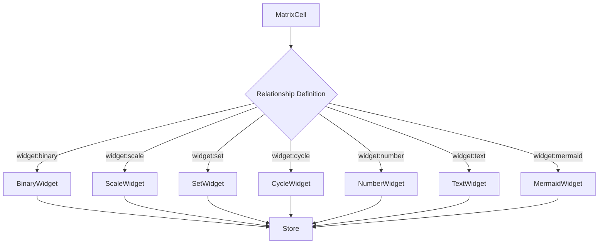
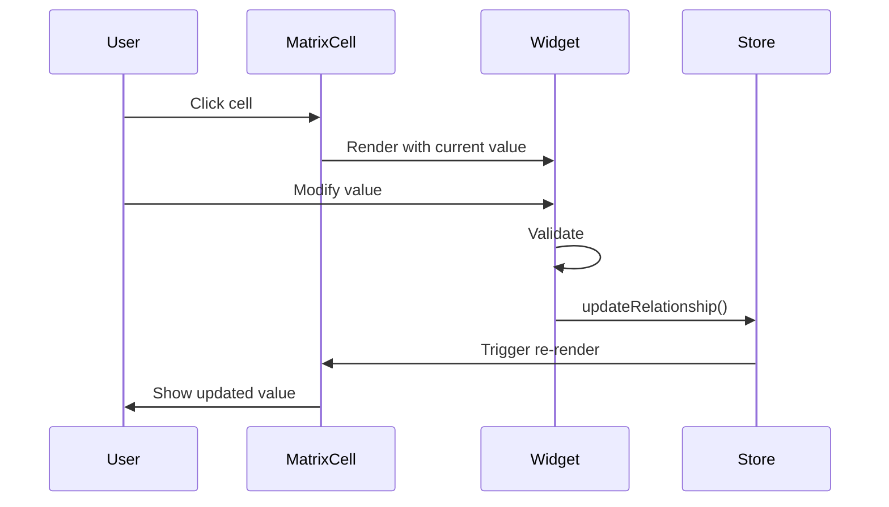

# Widgets Overview

Widgets are interactive components for editing relationship values in NN Modeler.

## What are Widgets?

Widgets define **how users interact** with relationships between model instances. Each relationship in the metamodel specifies a widget type and configuration via the YAML frontmatter.

```yaml
metamodel:
  relationships:
    - from: SourceClass
      to: TargetClass
      label: relationship_name
      widget: widget_type
      config:
        key: value
```

## Widget System Architecture



## Available Widgets

### 1. Binary Widget

**Purpose:** Yes/No, True/False decisions

**Syntax:**
```yaml
- from: Task
  to: Task
  label: is_critical
  widget: binary
  config:
    trueLabel: Critical
    falseLabel: Optional
```

**Use Cases:**
- Feature flags
- Approval status
- Dependency existence
- Requirement criticality

**Interaction:** Click to cycle: null → true → false → null

[Full Documentation](./binary-widget.md)

---

### 2. Scale Widget

**Purpose:** Numeric ratings with visual gradient

**Syntax:**
```yaml
- from: Task
  to: Stakeholder
  label: impact
  widget: scale
  config:
    min: 1
    max: 10
    startColor: blue-400
    endColor: red-600
```

**Use Cases:**
- Impact scores
- Priority ratings
- Confidence levels
- Risk assessments

**Interaction:** Click to open modal with slider

[Full Documentation](./scale-widget.md)

---

### 3. Set Widget

**Purpose:** Selection from predefined options

**Syntax:**
```yaml
- from: Task
  to: Person
  label: assigned_to
  widget: set
  config:
    options: [Alice, Bob, Charlie]
    allowEmpty: true
```

**Use Cases:**
- Assignment to team members
- Status selection
- Category classification
- Role assignment

**Interaction:** Click to open modal with option list

[Full Documentation](./set-widget.md)

---

### 4. Cycle Widget

**Purpose:** Click-to-cycle through values

**Syntax:**
```yaml
- from: Task
  to: Task
  label: status
  widget: cycle
  config:
    values: [Todo, In Progress, Done]
    allowNull: true
```

**Use Cases:**
- Workflow status
- Phase progression
- State machines
- Quick toggles

**Interaction:** Click directly on cell to cycle

[Full Documentation](./cycle-widget.md)

---

### 5. Number Widget

**Purpose:** Numeric values with formatting

**Syntax:**
```yaml
- from: Task
  to: Task
  label: budget
  widget: number
  config:
    decimals: 2
    format: currency
    currency: USD
    min: 0
```

**Use Cases:**
- Budget amounts
- Percentages
- Quantities
- Measurements

**Interaction:** Click to open modal with number input

[Full Documentation](./number-widget.md)

---

### 6. Text Widget

**Purpose:** Free-form text input

**Syntax:**
```yaml
- from: Task
  to: Object
  label: notes
  widget: text
  config:
    multiline: true
    maxLength: 500
```

**Use Cases:**
- Comments
- Descriptions
- Notes
- Short documentation

**Interaction:** Click to open modal with text input

[Full Documentation](./text-widget.md)

---

### 7. Mermaid Widget

**Purpose:** Diagram-based relationships

**Syntax:**
```yaml
- from: Task
  to: Task
  label: flow
  widget: mermaid
  config:
    diagramType: flowchart
    direction: LR
```

**Use Cases:**
- Process flows
- Sequence diagrams
- State transitions
- Complex relationships

**Interaction:** Click to open modal with Mermaid editor

[Full Documentation](./mermaid-widget.md)

---

## Widget Comparison

| Widget  | Input Type     | Visual Feedback  | Best For            | Complexity |
| ------- | -------------- | ---------------- | ------------------- | ---------- |
| Binary  | Click          | Checkmark/X      | Simple yes/no       | ⭐          |
| Scale   | Slider         | Color gradient   | Ratings 1-N         | ⭐⭐         |
| Set     | Dropdown       | Selected option  | Fixed choices       | ⭐⭐         |
| Cycle   | Click          | Current value    | Status progression  | ⭐⭐         |
| Number  | Input          | Formatted number | Quantities          | ⭐⭐⭐        |
| Text    | Input/Textarea | Text preview     | Notes, descriptions | ⭐⭐⭐        |
| Mermaid | Code editor    | Diagram preview  | Complex diagrams    | ⭐⭐⭐⭐       |

## Choosing the Right Widget

### Decision Tree

**Decision Tree:**

*   **Boolean/Yes-No?** -> `Binary Widget`
*   **Numeric?**
    *   Fixed range + visual gradient? -> `Scale Widget`
    *   Arbitrary amount? -> `Number Widget`
*   **Text?**
    *   Fixed options?
        *   Frequently changing? -> `Cycle Widget`
        *   Standard selection? -> `Set Widget`
    *   Free form? -> `Text Widget`
*   **Diagram/Complex?** -> `Mermaid Widget`

### Guidelines

**Use Binary when:**
- Data is true/false
- Simple yes/no decision
- Feature flag or toggle

**Use Scale when:**
- Numeric rating (1-5, 1-10, etc.)
- Visual gradient helps understanding
- Subjective assessment

**Use Set when:**
- Fixed list of options
- Options don't change frequently
- Single selection required

**Use Cycle when:**
- Fixed list of options
- Values change frequently (e.g., status)
- Quick interaction needed

**Use Number when:**
- Arbitrary numeric value
- Formatting needed (currency, percentage)
- Range validation required

**Use Text when:**
- Free-form input
- No predefined options
- Descriptions or notes

**Use Mermaid when:**
- Relationship is a diagram
- Complex visual structure
- Process flow or sequence

## Widget Configuration

### Common Patterns

#### Optional vs Required

```yaml
# Optional (allowEmpty: true)
- from: Task
  to: Person
  label: assigned_to
  widget: set
  config:
    options: [Alice, Bob]
    allowEmpty: true

# Required (allowNull: false)
- from: Task
  to: Task
  label: status
  widget: cycle
  config:
    values: [Todo, Done]
    allowNull: false
```

#### Range Constraints

```yaml
# Scale with range
- from: Task
  to: Task
  label: priority
  widget: scale
  config:
    min: 1
    max: 5

# Number with min/max
- from: Task
  to: Task
  label: budget
  widget: number
  config:
    min: 0
    max: 1000000
```

#### Visual Customization

```yaml
# Scale with custom colors
- from: Task
  to: Task
  label: risk
  widget: scale
  config:
    min: 1
    max: 10
    startColor: green-400
    endColor: red-600

# Binary with custom labels
- from: Task
  to: Task
  label: approved
  widget: binary
  config:
    trueLabel: Approved
    falseLabel: Rejected
```

## Multiple Widgets Per Cell

The same source-target pair can have multiple relationship types:

```yaml
metamodel:
  relationships:
    - from: Task
      to: Object
      label: status
      widget: cycle
      config:
        values: [Pending, Done]
    - from: Task
      to: Object
      label: completion
      widget: number
      config:
        format: percentage
    - from: Task
      to: Object
      label: notes
      widget: text
      config:
        multiline: true
```

In the matrix, one cell shows all three relationships.

## Widget Lifecycle



## Widget Implementation

### Creating a Custom Widget

1. **Define type** in `src/core/types.ts`:
   ```typescript
   export type WidgetType = 'binary' | 'scale' | 'set' | 'cycle' | 'number' | 'text' | 'mermaid' | 'custom';
   
   export interface CustomConfig {
     option1: string;
     option2: number;
   }
   ```

2. **Create component** in `src/components/widgets/CustomWidget.tsx`:
   ```typescript
   interface CustomWidgetProps {
     value: any;
     config: CustomConfig;
     onChange: (value: any) => void;
   }
   
   export function CustomWidget({ value, config, onChange }: CustomWidgetProps) {
     // Implementation
   }
   ```

3. **Update parser** in `src/core/parser.ts`:
   - Add config parsing logic
   - Add serialization logic

4. **Add to MatrixCell** in `src/components/common/MatrixCell.tsx`:
   ```typescript
   {widget === 'custom' && (
     <CustomWidget value={value} config={config} onChange={handleChange} />
   )}
   ```

## Best Practices

### 1. Match Widget to Data Type

Don't use text widget for numeric data - use number or scale.

### 2. Provide Clear Labels

```yaml
# Good
- from: Task
  to: Task
  label: is_critical
  widget: binary
  config:
    trueLabel: Critical
    falseLabel: Not Critical

# Bad
- from: Task
  to: Task
  label: flag
  widget: binary
  config:
    trueLabel: Yes
    falseLabel: No
```

### 3. Set Appropriate Ranges

```mermaid
%% Good - reasonable range
Task --> Task : priority {widget:scale, config:{min:1, max:5}}

%% Bad - too granular
Task --> Task : priority {widget:scale, config:{min:1, max:100}}
```

### 4. Use Cycle for Frequent Changes

If users will change a value often, use cycle widget for quick interaction.

### 5. Validate Input

Always set min/max for number widgets, maxLength for text widgets.

## Accessibility

All widgets support:
- **Keyboard navigation** (future enhancement)
- **Screen readers** (ARIA labels)
- **High contrast mode** (color-blind friendly)
- **Focus indicators**

## Performance

Widgets are optimized for:
- **Fast rendering** - Minimal re-renders
- **Lazy loading** - Modals load on demand
- **Efficient updates** - Only affected cells re-render

## Future Enhancements

Potential new widgets:
- **Date/Time** - Calendar picker
- **Color** - Color picker
- **File** - File upload
- **Multi-Select** - Multiple options from set
- **Slider** - Alternative to scale
- **Rich Text** - Markdown editor

## Documentation

Each widget has detailed documentation:
- Syntax and configuration
- Use cases and examples
- Interaction patterns
- Best practices

See individual widget docs for complete reference.
