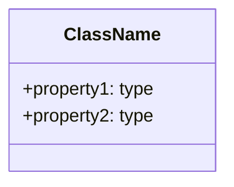

# Syntax and Conventions Reference

**Purpose:** This document provides a complete syntax reference for AI assistants working with NN Modeler files and concepts.

**Last Updated:** 2025-12-03

## File Format Overview

NN Modeler uses `.nn.md` files - Markdown files with embedded Mermaid diagrams.

### File Structure

```
# [Model Title]

## Metamodel
[Mermaid classDiagram defining classes and relationships]

## Model
[Logseq-style outline with [[wikilinks]]]

## Relationships
[Mermaid graph showing instance connections]

## Documentation
[Optional: Markdown docs for specific nodes]
```

## Metamodel Syntax

### Class Definition



**Rules:**
- Class name: PascalCase or any string
- Annotations (`@lucideIcon`, `@emoji`, `@color`) are optional
- Lucide icons take priority over emojis
- Properties are optional

**Valid Colors:**
`blue`, `green`, `red`, `yellow`, `purple`, `pink`, `indigo`, `gray`, `orange`, `teal`, `cyan`

### Relationship Definition

```mermaid
classDiagram
    SourceClass "cardinality" --> "cardinality" TargetClass : label {widget:type, config:{...}}
```

**Syntax Components:**

1. **Source/Target:** Class names (must exist in metamodel)
2. **Cardinality:** `"1"`, `"0..1"`, `"0..*"`, `"1..*"` (optional, for documentation)
3. **Label:** Relationship identifier (alphanumeric, underscores allowed)
4. **Widget:** One of: `binary`, `scale`, `set`, `cycle`, `number`, `text`, `mermaid`
5. **Config:** Widget-specific configuration (see Widget Configs below)

### Widget Configurations

#### Binary Widget
```
{widget:binary, config:{trueLabel:Yes, falseLabel:No}}
```
- `trueLabel` (optional): String, default "Yes"
- `falseLabel` (optional): String, default "No"

#### Scale Widget
```
{widget:scale, config:{min:1, max:10, startColor:blue-400, endColor:red-600, step:1}}
```
- `min` (required): Number
- `max` (required): Number
- `step` (optional): Number, default 1
- `startColor` (optional): Tailwind color, default "blue-500"
- `endColor` (optional): Tailwind color, default "purple-600"

#### Set Widget
```
{widget:set, config:{options:[High, Medium, Low], allowEmpty:true}}
```
- `options` (required): Array of strings `[Value1, Value2, Value3]`
- `allowEmpty` (optional): Boolean, default true

#### Cycle Widget
```
{widget:cycle, config:{values:[Planned, In Progress, Done], allowNull:true, nullLabel:Not Started}}
```
- `values` (required): Array of strings
- `allowNull` (optional): Boolean, default true
- `nullLabel` (optional): String, default "·"

#### Number Widget
```
{widget:number, config:{decimals:2, format:currency, currency:EUR, min:0, max:1000000}}
```
- `decimals` (optional): 0, 1, 2, or 3, default 0
- `format` (optional): `number`, `percentage`, or `currency`, default "number"
- `currency` (optional): Currency code (USD, EUR, etc.), default "USD"
- `min` (optional): Number
- `max` (optional): Number

#### Text Widget
```
{widget:text, config:{multiline:false, maxLength:200, placeholder:Enter text}}
```
- `multiline` (optional): Boolean, default false
- `maxLength` (optional): Number
- `placeholder` (optional): String

#### Mermaid Widget
```
{widget:mermaid, config:{diagramType:flowchart, direction:LR}}
```
- `diagramType` (required): `flowchart`, `sequenceDiagram`, `stateDiagram`, `erDiagram`, `gantt`, `graph`
- `direction` (optional): `LR`, `TD`, `RL`, `BT`

### Config Syntax Rules

- **No quotes** around keys or simple values
- **Arrays:** `[Value1, Value2, Value3]` (no quotes around values unless they contain special chars)
- **Booleans:** `true` or `false` (lowercase, no quotes)
- **Numbers:** Plain numbers (no quotes)
- **Strings with spaces:** Use quotes only if necessary for parsing

## Model Syntax

### Outline Format

```markdown
## Model

- [[RootClass1]]
    - [[Instance1]]
        - [[NestedInstance]]
    - [[Instance2]]
- [[RootClass2]]
    - [[Instance3]]
```

**Rules:**
- Use Logseq-style indentation (4 spaces or 1 tab per level)
- All node names MUST be wrapped in `[[double brackets]]`
- First level should be class names from metamodel
- Subsequent levels are instances of those classes
- Hierarchy determines parent-child relationships

### Node Naming

- **Unique:** Each `[[Node Name]]` should be unique across the entire model
- **Descriptive:** Use clear, meaningful names
- **No special chars:** Avoid `|`, `#`, `@` in node names
- **Spaces allowed:** `[[My Task Name]]` is valid

## Relationships Syntax

### Graph Format

```mermaid
graph LR
    [[Source Node]] -- "label:value" --> [[Target Node]]
```

**Rules:**
- Use `graph LR` or `graph TD` (direction doesn't affect parsing)
- Node names must match exactly (including brackets)
- Format: `-- "label:value" -->`
- Label must match a relationship label from metamodel
- Value format depends on widget type

### Relationship Values by Widget

| Widget  | Value Format      | Example                  |
| ------- | ----------------- | ------------------------ |
| Binary  | `true` or `false` | `"assigned:true"`        |
| Scale   | Number            | `"priority:5"`           |
| Set     | Option string     | `"status:High"`          |
| Cycle   | Value string      | `"phase:In Progress"`    |
| Number  | Number            | `"budget:50000"`         |
| Text    | String            | `"notes:This is a note"` |
| Mermaid | Mermaid syntax    | `"flow:A --> B"`         |

### Default Label

If relationship label is "default", it can be omitted:
```mermaid
graph LR
    [[Node A]] -- "value" --> [[Node B]]
```

## Documentation Syntax

### Format

```markdown
## Documentation

---doc [[Node Name]]
[Markdown content for this node]
---

---doc [[Another Node]]
[More markdown content]
---
```

**Rules:**
- Use `---doc [[Node Name]]` as opening delimiter
- Use `---` as closing delimiter
- Node name must match exactly
- Content between delimiters is full Markdown (headings, lists, code blocks, etc.)
- Multiple paragraphs and any heading levels allowed without restrictions
- Delimiters prevent conflicts with markdown headings in documentation

## Type Inference

The parser infers node types based on hierarchy:

1. **First-level nodes:** Must match a class name from metamodel
2. **Child nodes:** Inherit parent's class or use explicit type if parent is also a class

**Example:**
```
- [[Work]]          ← Type: "Work" (class)
    - [[Task 1]]    ← Type: "Work" (inferred from parent)
    - [[Task 2]]    ← Type: "Work" (inferred from parent)
```

## Icon Syntax

### Lucide Icons (Priority)

```mermaid
%% @lucideIcon CheckSquare
```

- Use exact Lucide icon name (PascalCase)
- See: https://lucide.dev/icons

### Emoji Fallback

```mermaid
%% @emoji 📋
```

- Use any Unicode emoji
- Rendered if no Lucide icon specified

## Common Patterns

### Self-Relationships

```mermaid
classDiagram
    Work "1" --> "0..*" Work : depends_on {widget:binary}
```

Used for: dependencies, hierarchies, categorization

### Multiple Relationships

```mermaid
classDiagram
    Work --> Object : input {widget:text}
    Work --> Object : output {widget:text}
    Work --> Object : status {widget:cycle, config:{values:[Pending, Done]}}
```

Same source/target, different labels

### Unified Node Types

```mermaid
classDiagram
    class Item
    Item --> Item : relationship {widget:set, config:{options:[Type1, Type2]}}
```

Single class for all nodes, differentiated by relationships

## Validation Rules

### Metamodel
- ✅ At least one class must be defined
- ✅ Relationship labels must be unique per source-target pair
- ✅ Widget type must be valid
- ✅ Config must match widget requirements

### Model
- ✅ All nodes must have `[[brackets]]`
- ✅ First-level nodes should match class names
- ✅ Indentation must be consistent

### Relationships
- ✅ Source and target nodes must exist in model
- ✅ Label must exist in metamodel for that source-target class pair
- ✅ Value must be valid for widget type

## Error Handling

**Parser behavior:**
- Invalid widget type → defaults to `text`
- Missing config → uses widget defaults
- Invalid relationship → skipped with warning
- Malformed Mermaid → section ignored

## Examples

See `/public/example-*.nn.md` files for complete working examples.

## For AI Assistants

When generating or modifying `.nn.md` files:

1. **Always validate** syntax against this reference
2. **Preserve existing** structure when making changes
3. **Use consistent** indentation (4 spaces)
4. **Match exact** node names when creating relationships
5. **Provide complete** config objects for widgets
6. **Test** that Mermaid syntax is valid
7. **Document** complex nodes when requested
8. **Validate widget values**: When proposing relationships, ensure values match widget constraints
   - For `set` widgets: use ONLY values from the `options` array
   - For `cycle` widgets: use ONLY values from the `values` array
   - For `scale` widgets: use numbers within the min/max range
   - For `binary` widgets: use `true` or `false` only

### Widget Value Examples

| Widget Type | Config                           | ✅ Valid Values        | ❌ Invalid Values       |
| ----------- | -------------------------------- | --------------------- | ---------------------- |
| set         | `{options:[input, output]}`      | "input", "output"     | "uno", "primero", "in" |
| cycle       | `{values:[Low, Med, High]}`      | "Low", "Med", "High"  | "Medium", "L", "1"     |
| scale       | `{min:1, max:10}`                | 1, 5, 10              | 0, 11, "5"             |
| binary      | `{trueLabel:Yes, falseLabel:No}` | true, false           | "Yes", "No", 1, 0      |
| number      | `{min:0, max:100, decimals:2}`   | 0, 50.5, 100          | -1, 101, "50"          |
| text        | `{maxLength:200}`                | Any string ≤200 chars | (strings >200 chars)   |

## Updates

This syntax reference should be updated when:
- New widget types are added
- Config options change
- File format evolves
- Parser behavior changes
